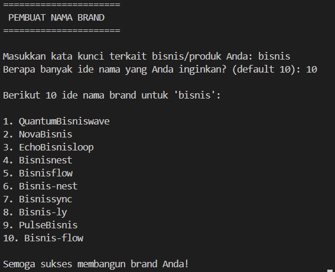

# Brand Name Generator

## Deskripsi Proyek
Brand Name Generator adalah skrip Python berbasis command-line (CLI) yang menghasilkan ide nama brand/merek secara acak berdasarkan kata kunci yang dimasukkan pengguna. Proyek ini menyelesaikan masalah "writer's block" saat mencari nama untuk bisnis, produk, atau startup baru, dengan cara mengombinasikan kata kunci pengguna dengan berbagai prefix dan suffix yang terdengar modern dan catchy.

## Tampilan Aplikasi

## Fitur Utama
- Menghasilkan nama brand unik berdasarkan kata kunci yang diinput pengguna,
- Empat pola kombinasi berbeda: Prefix+Keyword, Keyword+Suffix, Prefix+Keyword+Suffix, dan Keyword-Suffix dengan hyphen,
- Jumlah nama yang dihasilkan dapat disesuaikan oleh pengguna,
- Hasil nama dijamin unik dalam satu kali generate,
- Validasi input sederhana.

## Teknologi yang Digunakan
- Python 3.x
- Modul `random`

## Arsitektur
Alur kerja skrip ini sederhana dan berjalan secara linear di terminal:
1. Program meminta input kata kunci dari pengguna.
2. Program meminta jumlah ide nama yang diinginkan.
3. Fungsi `generate_names()` mengombinasikan kata kunci dengan prefix/suffix secara acak menggunakan salah satu dari 4 pola, lalu menyimpannya ke dalam `set` agar tidak ada duplikat.
4. Hasil dikumpulkan hingga mencapai jumlah yang diminta atau batas maksimum percobaan tercapai.
5. Daftar nama brand ditampilkan ke layar dalam format list bernomor.

## Pembelajaran Spesifik
- Memahami cara menggunakan `set` di Python untuk memastikan hasil acak yang dihasilkan tetap unik tanpa duplikat.
- Belajar menerapkan batas maksimum percobaan (`max_attempts`) untuk mencegah program terjebak dalam infinite loop ketika kombinasi unik yang diminta lebih banyak daripada kombinasi yang mungkin dihasilkan.
- Melatih penanganan input pengguna yang tidak valid (misalnya input jumlah nama yang bukan angka) menggunakan `try-except`.
