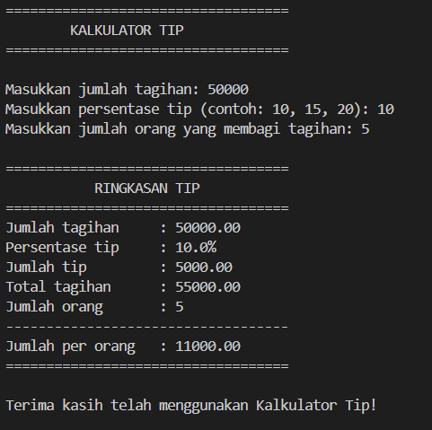

# Tip Calculator

## Deskripsi Proyek
Tip Calculator adalah skrip Python berbasis command-line (CLI) yang menghitung jumlah tip dan membagi total tagihan secara merata ke beberapa orang. Proyek ini menyelesaikan masalah menghitung tip secara manual yang rawan salah hitung, terutama saat tagihan harus dibagi ke banyak orang dengan persentase tip tertentu.

## Tampilan Aplikasi

## Fitur Utama
- Menghitung jumlah tip berdasarkan persentase yang diinput pengguna,
- Menghitung total tagihan,
- Membagi total tagihan secara merata sesuai jumlah orang,
- Validasi input otomatis: menolak angka negatif dan input yang bukan angka, lalu meminta input ulang,
- Menampilkan ringkasan hasil perhitungan dalam format struk yang rapi.

## Teknologi yang Digunakan
- Python 3.x

## Arsitektur
Alur kerja skrip ini berjalan secara linear di terminal:
1. Program meminta input jumlah tagihan.
2. Program meminta input persentase tip yang diinginkan.
3. Program meminta input jumlah orang yang akan membagi tagihan.
4. Fungsi `calculate_tip()` menghitung jumlah tip, total tagihan, dan jumlah yang harus dibayar per orang.
5. Fungsi `print_receipt()` menampilkan hasil perhitungan dalam format ringkasan yang mudah dibaca.

## Pembelajaran Spesifik
- Membuat fungsi validasi input yang reusable (`get_positive_float` dan `get_positive_int`) menggunakan perulangan `while True` dan `try-except` agar program tidak crash saat menerima input yang salah.
- Memisahkan logika perhitungan (`calculate_tip`) dari logika tampilan (`print_receipt`) agar kode lebih modular dan mudah diuji atau dikembangkan lebih lanjut.
- Menggunakan f-string dengan format angka desimal (`:.2f`) untuk menampilkan nilai uang secara rapi dan konsisten.
