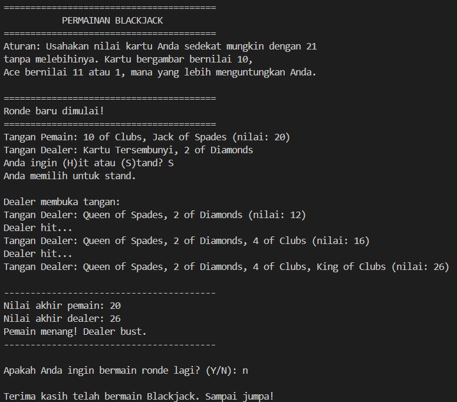

# Blackjack Game

## Deskripsi Proyek
Blackjack Game adalah skrip Python berbasis command-line (CLI) yang mengimplementasikan permainan kartu Blackjack melawan dealer komputer. Proyek ini menyelesaikan masalah mensimulasikan permainan kartu klasik secara digital, lengkap dengan logika perhitungan nilai kartu, giliran pemain, dan giliran dealer yang mengikuti aturan kasino standar.

## Tampilan Aplikasi

## Fitur Utama
- Deck 52 kartu standar yang diacak secara otomatis di setiap ronde,
- Perhitungan nilai tangan (hand) secara otomatis, termasuk logika khusus kartu As,
- Giliran pemain untuk memilih Hit atau Stand,
- Giliran dealer otomatis mengikuti aturan kasino standar,
- Deteksi kondisi menang, kalah, seri, bust, dan Blackjack alami,
- Mendukung bermain berulang kali dalam satu sesi program,
- Validasi input agar pengguna hanya bisa memasukkan pilihan yang valid.

## Teknologi yang Digunakan
- Python 3.x
- Modul `random`

## Arsitektur
Alur kerja skrip ini berjalan dalam satu loop permainan per ronde:
1. `create_deck()` membuat dan mengacak 52 kartu.
2. Pemain dan dealer masing-masing menerima 2 kartu awal lewat `deal_card()`.
3. Kartu pertama dealer disembunyikan dari tampilan menggunakan parameter `hide_first` pada `show_hand()`.
4. Jika pemain langsung mendapat nilai 21, permainan berakhir dengan Blackjack alami.
5. `player_turn()` menjalankan loop giliran pemain (Hit/Stand) hingga pemain stand atau bust.
6. Jika pemain tidak bust, `dealer_turn()` menjalankan giliran dealer secara otomatis.
7. `determine_winner()` membandingkan nilai akhir kedua tangan dan menentukan hasil ronde.
8. Program menanyakan apakah pemain ingin bermain ronde baru atau berhenti.

## Pembelajaran Spesifik
- Menerapkan logika penghitungan nilai kartu As yang dinamis (bisa bernilai 11 atau 1) menggunakan pengecekan kondisi berulang agar tangan tidak bust jika masih memungkinkan.
- Memisahkan setiap tanggung jawab ke dalam fungsi kecil yang jelas (pembuatan deck, pembagian kartu, giliran pemain, giliran dealer, penentuan pemenang) agar kode lebih mudah dibaca dan di-maintain.
- Mengelola state permainan (deck, tangan pemain, tangan dealer) yang berubah antar ronde tanpa memengaruhi ronde sebelumnya, dengan membuat ulang deck di setiap awal ronde melalui `play_round()`.
- Menyembunyikan salah satu kartu dealer di awal ronde untuk mensimulasikan aturan Blackjack yang sesungguhnya, lalu membukanya kembali saat giliran dealer dimulai.
