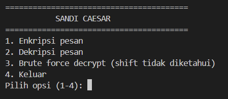
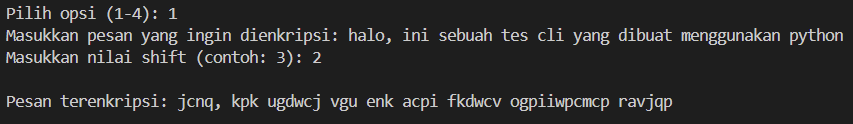
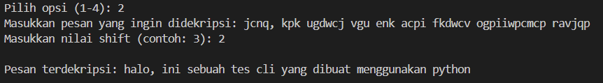
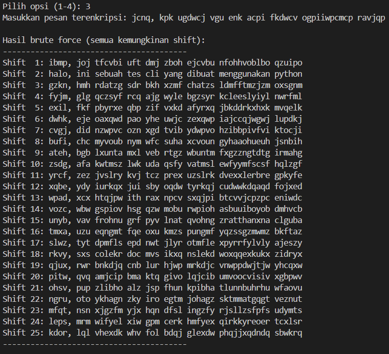
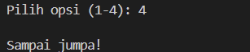

# Caesar Cipher

## Deskripsi Proyek
Caesar Cipher adalah skrip Python berbasis command-line (CLI) yang mengimplementasikan teknik enkripsi klasik Caesar Cipher, yaitu menggeser setiap huruf pada teks sejauh nilai tertentu di dalam alfabet. Proyek ini menyelesaikan masalah menyandikan (encrypt) dan membuka sandi (decrypt) pesan teks secara sederhana, serta menyediakan fitur brute force untuk mencoba semua kemungkinan pergeseran jika nilai shift tidak diketahui.

## Tampilan Aplikasi

### Tampilan awal

### Tampilan opsi 1

### Tampilan opsi 2

### Tampilan opsi 3

### Tampilan opsi 4

## Fitur Utama
- Enkripsi pesan dengan nilai pergeseran (shift) yang ditentukan pengguna
- Dekripsi pesan dengan nilai shift yang sudah diketahui
- Brute force decrypt yang mencoba seluruh 25 kemungkinan shift sekaligus, berguna untuk memecahkan pesan tanpa mengetahui shift aslinya
- Mempertahankan huruf kapital dan huruf kecil sesuai aslinya
- Karakter selain huruf tidak diubah
- Menu interaktif berbasis pilihan angka agar mudah digunakan berulang kali

## Teknologi yang Digunakan
- Python 3.x
- Modul `string`

## Arsitektur
Alur kerja skrip ini berbasis menu pilihan yang berjalan dalam loop:
1. `print_menu()` menampilkan pilihan: Encrypt, Decrypt, Brute Force, atau Exit.
2. Fungsi `shift_char()` menjadi inti dari seluruh proses, yaitu menggeser satu karakter menggunakan operasi modulo agar pergeseran tetap berada dalam rentang alfabet (wrap-around dari Z ke A).
3. `encrypt()` dan `decrypt()` memanggil `shift_char()` untuk setiap karakter dalam teks, dengan `decrypt()` menggunakan nilai shift negatif dari `encrypt()`.
4. `brute_force()` memanggil `decrypt()` sebanyak 25 kali dengan shift 1 sampai 25, lalu menampilkan seluruh hasilnya agar pengguna bisa menemukan pesan asli secara manual.
5. Program terus menampilkan menu hingga pengguna memilih opsi keluar (Exit).

## Pembelajaran Spesifik
- Memahami penggunaan operator modulo (`%`) untuk menangani wrap-around alfabet, sehingga pergeseran dari huruf Z tetap kembali ke A tanpa error.
- Menyadari bahwa proses dekripsi sebenarnya adalah enkripsi dengan nilai shift negatif, sehingga fungsi `decrypt()` bisa dibuat dengan memanfaatkan kembali logika `shift_char()` yang sama.
- Membedakan penanganan karakter berdasarkan huruf besar (`isupper()`), huruf kecil (`islower()`), dan karakter non-alfabet agar spasi, angka, dan tanda baca tidak ikut tersandi.
- Menerapkan fitur brute force sederhana sebagai simulasi cara kerja cryptanalysis dasar terhadap cipher substitusi seperti Caesar Cipher.
