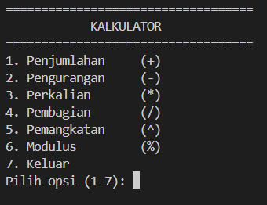
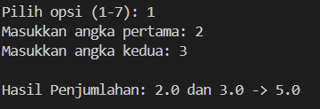
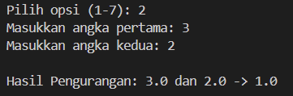
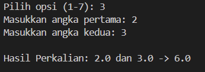
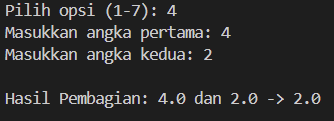
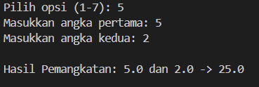
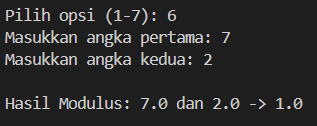
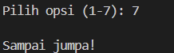

# Calculator

## Deskripsi Proyek
Calculator adalah skrip Python berbasis command-line (CLI) yang menyediakan operasi kalkulasi dasar hingga lanjutan antara dua angka, yaitu penjumlahan, pengurangan, perkalian, pembagian, pemangkatan, dan modulus. Proyek ini menyelesaikan masalah melakukan perhitungan cepat langsung dari terminal tanpa perlu membuka aplikasi kalkulator terpisah, sekaligus menangani kesalahan umum seperti pembagian dengan nol dan input yang bukan angka.

## Tampilan Aplikasi

### Tampilan awal

### Tampilan opsi 1

### Tampilan opsi 2

### Tampilan opsi 3

### Tampilan opsi 4

### Tampilan opsi 5

### Tampilan opsi 6

### Tampilan opsi 7

## Fitur Utama
- Enam operasi matematika: penjumlahan, pengurangan, perkalian, pembagian, pemangkatan, dan modulus
- Validasi input otomatis, program akan meminta input ulang jika bukan angka
- Penanganan error pembagian dan modulus dengan nol tanpa membuat program crash
- Menu interaktif berbasis pilihan angka yang bisa digunakan berulang kali dalam satu sesi
- Struktur kode yang rapi menggunakan dictionary untuk memetakan pilihan menu ke fungsi operasi

## Teknologi yang Digunakan
- Python 3.x
- Modul `math`

## Arsitektur
Alur kerja skrip ini berbasis menu pilihan yang berjalan dalam loop:
1. `print_menu()` menampilkan tujuh pilihan: enam operasi matematika dan opsi keluar.
2. Setiap operasi (`add`, `subtract`, `multiply`, `divide`, `power`, `modulus`) dipetakan ke dalam dictionary `operations` di dalam `main()`, sehingga pemilihan menu langsung mengarah ke fungsi yang sesuai tanpa banyak percabangan if-else.
3. `get_number()` memastikan input pengguna berupa angka yang valid sebelum perhitungan dilakukan.
4. Fungsi `divide()` dan `modulus()` melempar `ZeroDivisionError` jika pembagi bernilai nol, yang kemudian ditangkap di `main()` menggunakan blok `try-except` agar program tetap berjalan.
5. Hasil perhitungan ditampilkan langsung ke layar, dan menu akan muncul kembali hingga pengguna memilih opsi keluar.

## Pembelajaran Spesifik
- Menggunakan dictionary untuk memetakan pilihan menu ke fungsi operasi (`operations`), sehingga struktur kode lebih ringkas dibandingkan menuliskan banyak blok if-elif secara manual.
- Menerapkan exception handling (`try-except`) untuk menangani kasus pembagian dan modulus dengan nol tanpa menghentikan program secara paksa.
- Memahami perbedaan antara melempar error secara eksplisit menggunakan `raise` di dalam fungsi operasi, dengan menangkap error tersebut di lapisan pemanggil (`main()`).
- Membiasakan penulisan komentar dengan tanda pagar (#) sebagai dokumentasi kode, sebagai alternatif dari docstring segitiga tiga (\"\"\" \"\"\").
