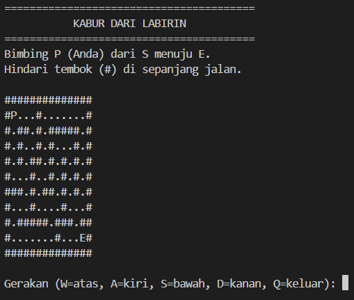

# Escape the Maze

## Deskripsi Proyek
Escape the Maze adalah skrip Python berbasis command-line (CLI) di mana pemain harus menavigasi sebuah karakter dari titik awal menuju titik keluar di dalam labirin berbasis ASCII. Proyek ini menyelesaikan masalah mensimulasikan logika pergerakan dan pathfinding sederhana berbasis grid, sekaligus memberikan pengalaman puzzle interaktif langsung di terminal.

## Tampilan Aplikasi

## Fitur Utama
- Labirin berbasis ASCII yang dirender langsung di terminal
- Pelacakan posisi pemain secara real-time, ditampilkan sebagai `P` di grid
- Pergerakan menggunakan W (atas), A (kiri), S (bawah), dan D (kanan)
- Deteksi tabrakan dengan tembok yang mencegah pemain menembus `#`
- Penghitung langkah yang melacak berapa banyak langkah yang diambil pemain untuk kabur
- Opsi untuk keluar dari permainan kapan saja menggunakan Q
- Kondisi menang yang otomatis terpicu saat pemain mencapai titik keluar (`E`)

## Teknologi yang Digunakan
- Python 3.x

## Arsitektur
Permainan berjalan dalam sebuah loop yang berulang kali menampilkan labirin dan memproses input pemain:
1. `build_maze()` mengubah template labirin (list of string) menjadi list 2D karakter agar setiap sel dapat dilacak dan diperbarui.
2. `find_symbol()` mencari posisi awal (`S`) dan posisi keluar (`E`) di dalam grid labirin.
3. `print_maze()` merender labirin ke terminal di setiap giliran, mengganti sel posisi pemain saat ini dengan `P`.
4. `get_move_input()` memvalidasi bahwa pemain hanya bisa memasukkan W, A, S, D, atau Q.
5. `get_new_position()` menghitung sel tujuan berdasarkan arah yang dipilih.
6. `is_valid_move()` memeriksa apakah sel tujuan berada dalam batas labirin dan bukan tembok (`#`) sebelum mengizinkan pergerakan.
7. Loop utama di `main()` mengulangi proses ini, menambah penghitung langkah setiap kali pergerakan berhasil, hingga pemain mencapai titik keluar atau memilih untuk keluar.

## Pembelajaran Spesifik
- Menerapkan logika pergerakan berbasis koordinat pada grid 2D menggunakan indeks baris dan kolom, alih-alih struktur graf yang lengkap.
- Memahami cara memeriksa batas array dengan aman sebelum mengakses sebuah sel, untuk menghindari `IndexError` saat pemain mencoba bergerak keluar dari labirin.
- Melatih pemisahan tanggung jawab dengan memecah permainan menjadi fungsi-fungsi kecil bertujuan tunggal: membangun labirin, merendernya, memvalidasi pergerakan, dan menangani loop permainan utama.
- Mempelajari cara merepresentasikan state permainan yang dapat berubah (posisi pemain) secara terpisah dari tata letak labirin yang statis, sehingga karakter dapat bergerak tanpa mengubah template labirin aslinya secara permanen.
