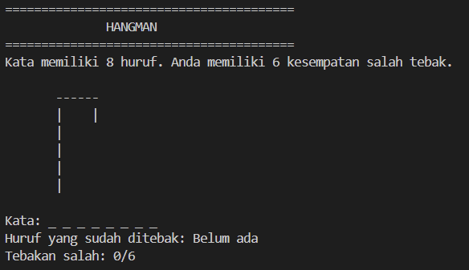

# Hangman Game

## Deskripsi Proyek
Hangman adalah skrip Python berbasis command-line (CLI) yang mengimplementasikan permainan tebak kata klasik Hangman. Pemain harus menebak huruf satu per satu untuk mengungkap kata tersembunyi sebelum kehabisan kesempatan salah tebak. Proyek ini menyelesaikan masalah mensimulasikan permainan Hangman secara digital lengkap dengan visualisasi ASCII art gantungan yang berubah setiap kali pemain salah menebak.

## Tampilan Aplikasi

## Fitur Utama
- Kata dipilih secara acak dari daftar kata yang tersedia di setiap ronde
- Visualisasi ASCII art gantungan yang berubah bertahap sesuai jumlah tebakan salah
- Validasi input agar pemain hanya bisa memasukkan satu huruf yang valid
- Deteksi huruf yang sudah pernah ditebak agar tidak dihitung ulang
- Menampilkan progres kata yang sudah berhasil ditebak (huruf terbuka) dan yang masih tersembunyi (garis bawah)
- Batas maksimal 6 kali salah tebak sebelum permainan berakhir
- Mendukung bermain berulang kali (multiple rounds) dalam satu sesi program

## Teknologi yang Digunakan
- Python 3.x
- Modul `random`

## Arsitektur
Alur kerja skrip ini berjalan dalam satu loop permainan per ronde:
1. `choose_word()` memilih satu kata secara acak dari `WORD_LIST`.
2. `get_display_word()` menampilkan kata dalam bentuk huruf yang sudah ditebak dan garis bawah (`_`) untuk huruf yang belum ditebak.
3. `print_hangman()` menampilkan tahapan ASCII art gantungan sesuai jumlah `wrong_guesses`, diambil dari daftar `HANGMAN_STAGES`.
4. `get_guess()` memvalidasi input pemain agar hanya berupa satu huruf dan belum pernah ditebak sebelumnya.
5. Loop utama di `main()` memeriksa apakah huruf yang ditebak ada di dalam kata; jika benar, huruf tersebut ditambahkan ke progres, jika salah, `wrong_guesses` bertambah satu.
6. Permainan berakhir dengan kemenangan jika seluruh huruf pada kata sudah ditebak, atau berakhir dengan kekalahan jika `wrong_guesses` mencapai `MAX_ATTEMPTS`.
7. Setelah satu ronde selesai, program menanyakan apakah pemain ingin bermain lagi.

## Pembelajaran Spesifik
- Menggunakan `set` untuk menyimpan huruf yang sudah ditebak, sehingga pengecekan huruf duplikat menjadi efisien dan sederhana.
- Menerapkan list berisi string multi-baris (`HANGMAN_STAGES`) sebagai cara sederhana untuk menampilkan animasi ASCII art bertahap berdasarkan state permainan.
- Memahami penggunaan `all()` dengan generator expression untuk mengecek apakah seluruh huruf dalam kata sudah berhasil ditebak, sebagai kondisi kemenangan.
- Memisahkan logika satu ronde permainan (`main()`) dari logika pengulangan sesi (`while True` di bagian `if __name__ == "__main__"`), sehingga setiap ronde baru dimulai dengan state yang benar-benar bersih.
