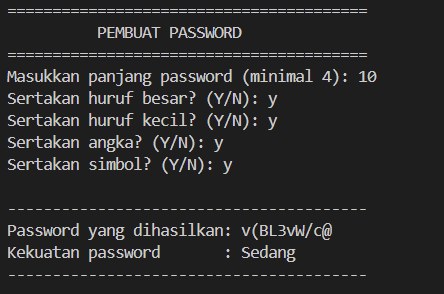

# Password Generator

## Deskripsi Proyek
Password Generator adalah skrip Python berbasis command-line (CLI) yang menghasilkan password acak yang aman berdasarkan panjang dan jenis karakter yang dipilih pengguna (huruf besar, huruf kecil, angka, dan simbol). Proyek ini menyelesaikan masalah membuat password yang kuat secara manual, yang sering kali memakan waktu dan cenderung mudah ditebak jika dibuat sendiri oleh manusia.

## Tampilan Aplikasi

## Fitur Utama
- Panjang password dapat disesuaikan oleh pengguna (minimal 4 karakter)
- Pilihan jenis karakter yang fleksibel: huruf besar, huruf kecil, angka, dan simbol
- Validasi otomatis jika pengguna tidak memilih satu jenis karakter pun, program akan menggunakan huruf kecil sebagai default
- Penilaian kekuatan password (Weak, Medium, Strong) berdasarkan panjang dan variasi karakter yang digunakan
- Mendukung pembuatan password berulang kali dalam satu sesi program
- Validasi input untuk memastikan panjang password berupa angka yang valid

## Teknologi yang Digunakan
- Python 3.x
- Modul `random` dan `string`

## Arsitektur
Alur kerja skrip ini berjalan secara berurutan di setiap sesi pembuatan password:
1. `get_password_length()` meminta panjang password dan memvalidasi agar minimal 4 karakter serta berupa angka yang valid.
2. `ask_yes_no()` menanyakan preferensi jenis karakter (huruf besar, huruf kecil, angka, simbol) kepada pengguna.
3. `build_character_pool()` menggabungkan seluruh jenis karakter yang dipilih menjadi satu kumpulan karakter (pool) yang akan digunakan untuk generate password.
4. Jika pengguna tidak memilih satu jenis karakter pun, program secara otomatis menggunakan huruf kecil sebagai fallback agar password tetap bisa dibuat.
5. `generate_password()` mengambil karakter secara acak dari pool sebanyak panjang yang ditentukan menggunakan `random.choice()`.
6. `rate_strength()` menilai kekuatan password berdasarkan kombinasi panjang password dan jumlah jenis karakter yang digunakan.
7. Program menampilkan password yang dihasilkan beserta tingkat kekuatannya, lalu menanyakan apakah pengguna ingin membuat password lain.

## Pembelajaran Spesifik
- Menggunakan modul `string` untuk mengakses kumpulan karakter bawaan seperti `ascii_uppercase`, `ascii_lowercase`, `digits`, dan `punctuation` tanpa perlu menuliskannya secara manual.
- Membangun character pool secara dinamis berdasarkan kombinasi pilihan pengguna menggunakan penggabungan string sederhana.
- Menerapkan logika fallback (nilai default) ketika pengguna tidak memilih satu jenis karakter pun, agar program tetap dapat menghasilkan password alih-alih error atau menghasilkan password kosong.
- Merancang sistem penilaian kekuatan password sederhana berdasarkan dua faktor sekaligus: panjang karakter dan variasi jenis karakter yang digunakan.
