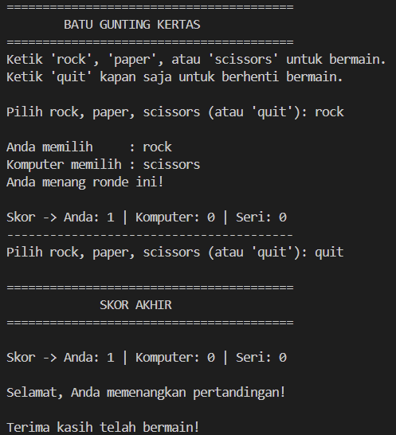

# Rock Paper Scissors

## Deskripsi Proyek
Rock Paper Scissors adalah skrip Python berbasis command-line (CLI) yang mengimplementasikan permainan batu-gunting-kertas antara pemain melawan komputer. Proyek ini menyelesaikan masalah mensimulasikan permainan klasik ini secara digital, lengkap dengan pelacakan skor antar ronde hingga pemain memutuskan untuk berhenti bermain.

## Tampilan Aplikasi

## Fitur Utama
- Pilihan komputer dihasilkan secara acak di setiap ronde
- Validasi input agar pemain hanya bisa memasukkan "rock", "paper", "scissors", atau "quit"
- Logika penentuan pemenang berdasarkan aturan standar (batu mengalahkan gunting, gunting mengalahkan kertas, kertas mengalahkan batu)
- Pelacakan skor otomatis (menang, kalah, seri) yang terus diperbarui selama sesi bermain
- Mendukung bermain berulang ronde tanpa batas hingga pemain mengetik "quit"
- Ringkasan skor akhir dan status pemenang keseluruhan pertandingan saat permainan selesai

## Teknologi yang Digunakan
- Python 3.x
- Modul `random`

## Arsitektur
Alur kerja skrip ini berjalan dalam satu loop permainan yang berlangsung hingga pemain berhenti:
1. `get_computer_choice()` memilih salah satu dari "rock", "paper", "scissors" secara acak menggunakan `random.choice()`.
2. Pemain memasukkan pilihannya langsung di loop utama `main()`, dengan opsi tambahan mengetik "quit" untuk keluar kapan saja.
3. `determine_winner()` membandingkan pilihan pemain dan komputer menggunakan dictionary `WINNING_RULES`, yang memetakan setiap pilihan terhadap pilihan yang dikalahkannya.
4. `print_round_result()` menampilkan hasil ronde (menang, kalah, atau seri) berdasarkan pilihan kedua belah pihak.
5. `print_score()` menampilkan skor yang terus terakumulasi (jumlah menang, kalah, dan seri) setelah setiap ronde.
6. Setelah pemain mengetik "quit", program menampilkan ringkasan skor akhir beserta status pemenang keseluruhan pertandingan.

## Pembelajaran Spesifik
- Merancang logika penentuan pemenang menggunakan dictionary (`WINNING_RULES`) sebagai pengganti banyak percabangan if-elif, sehingga aturan permainan lebih mudah dibaca dan dikembangkan (misalnya jika ingin menambah pilihan seperti "lizard" atau "spock").
- Memisahkan tanggung jawab kode ke dalam fungsi-fungsi kecil (mendapatkan pilihan, menentukan pemenang, menampilkan hasil, menampilkan skor) agar loop utama tetap ringkas dan mudah dibaca.
- Mengelola state skor (menang, kalah, seri) yang terus berubah antar ronde menggunakan variabel yang diperbarui di dalam loop, tanpa perlu struktur data yang rumit.
- Menyediakan mekanisme keluar yang fleksibel ("quit") di tengah permainan tanpa mengganggu alur validasi input pilihan utama.
