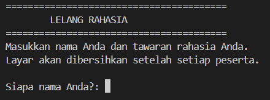

# The Secret Auction Program

## Deskripsi Proyek
The Secret Auction Program adalah skrip Python berbasis command-line (CLI) yang mensimulasikan lelang rahasia, di mana setiap peserta memasukkan nama dan tawaran mereka secara bergiliran tanpa bisa melihat tawaran peserta lain. Proyek ini menyelesaikan masalah menentukan pemenang lelang secara adil dan rahasia, layaknya sistem lelang tertutup di dunia nyata, dengan cara membersihkan layar terminal setiap kali giliran peserta berikutnya dimulai.

## Tampilan Aplikasi

## Fitur Utama
- Setiap peserta memasukkan nama dan tawaran secara bergiliran tanpa melihat tawaran peserta lain
- Layar terminal otomatis dibersihkan setelah setiap peserta selesai memasukkan tawaran, menjaga kerahasiaan bid
- Validasi input nama (tidak boleh kosong) dan tawaran (harus berupa angka lebih dari 0)
- Penyimpanan seluruh tawaran menggunakan dictionary, memetakan nama peserta ke jumlah tawarannya
- Penentuan otomatis peserta dengan tawaran tertinggi sebagai pemenang lelang
- Mendukung jumlah peserta yang fleksibel, sesi lelang berlanjut selama pengguna menjawab "Y" saat ditanya apakah masih ada peserta lain

## Teknologi yang Digunakan
- Python 3.x
- Modul `os` 

## Arsitektur
Alur kerja skrip ini berjalan dalam satu loop yang mengumpulkan data dari setiap peserta:
1. `get_bidder_name()` dan `get_bid_amount()` meminta dan memvalidasi input nama serta jumlah tawaran dari peserta yang sedang mendapat giliran.
2. Setiap pasangan nama dan tawaran disimpan ke dalam dictionary `bids` di dalam `main()`.
3. `ask_yes_no()` menanyakan apakah masih ada peserta lain yang akan memberikan tawaran.
4. `clear_screen()` membersihkan layar terminal setelah setiap peserta selesai, menggunakan perintah `cls` untuk Windows atau `clear` untuk Linux/macOS, sehingga peserta berikutnya tidak bisa melihat tawaran sebelumnya.
5. Setelah seluruh peserta selesai memasukkan tawaran, `find_highest_bidder()` melakukan iterasi terhadap dictionary `bids` untuk menemukan nama dan jumlah tawaran tertinggi.
6. Hasil akhir lelang, yaitu nama pemenang dan jumlah tawaran tertingginya, ditampilkan ke layar.

## Pembelajaran Spesifik
- Menggunakan modul `os` untuk membersihkan layar terminal secara lintas platform (`cls` di Windows, `clear` di Linux/macOS) demi menjaga kerahasiaan tawaran antar peserta.
- Memanfaatkan dictionary sebagai struktur data yang tepat untuk memetakan setiap peserta ke tawarannya, sehingga pencarian tawaran tertinggi menjadi sederhana dengan iterasi `items()`.
- Memahami pentingnya validasi input pada konteks nilai uang/numerik, seperti memastikan tawaran harus lebih besar dari 0 dan berupa angka yang valid.
- Merancang alur program berbasis giliran (turn-based) yang fleksibel terhadap jumlah peserta, tanpa perlu menentukan jumlah peserta di awal program.
