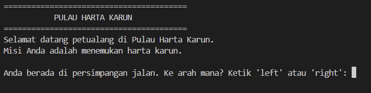

# Treasure Island

## Deskripsi Proyek
Treasure Island adalah skrip Python berbasis command-line (CLI) yang mengimplementasikan permainan petualangan teks, di mana pemain membuat serangkaian pilihan yang menentukan jalan cerita dan akhir permainan. Proyek ini menyelesaikan masalah mensimulasikan cerita interaktif bercabang secara sederhana menggunakan alur logika percabangan, lengkap dengan beberapa kemungkinan akhir cerita mulai dari menemukan harta karun hingga berbagai jebakan.

## Tampilan Aplikasi

## Fitur Utama
- Cerita bercabang (branching story) dengan beberapa titik keputusan yang memengaruhi jalannya permainan
- Empat kemungkinan akhir cerita berbeda: tenggelam, ditangkap troll, terjebak api, atau menemukan harta karun
- Efek teks berjalan (typing effect) menggunakan jeda antar karakter untuk menambah kesan dramatis
- Validasi input agar pemain hanya bisa memasukkan pilihan yang tersedia di setiap titik keputusan
- Mendukung bermain berulang kali (multiple playthroughs) dalam satu sesi program

## Teknologi yang Digunakan
- Python 3.x
- Modul `time` (bawaan Python, digunakan untuk efek teks berjalan)

## Arsitektur
Alur kerja skrip ini berjalan sebagai rangkaian pilihan berurutan yang menentukan cabang cerita:
1. `slow_print()` menampilkan teks karakter demi karakter dengan jeda singkat untuk menciptakan efek dramatis khas game petualangan teks.
2. `ask_choice()` menampilkan pertanyaan dan memvalidasi jawaban pemain agar hanya sesuai dengan pilihan yang tersedia (misalnya hanya "left" atau "right").
3. `main()` menjalankan alur cerita secara berurutan: persimpangan jalan pertama, penyeberangan sungai, dan pemilihan pintu di akhir cerita.
4. Setiap pilihan yang salah akan memanggil salah satu fungsi ending (`ending_drown()`, `ending_trolls()`, `ending_fire()`) yang langsung mengakhiri permainan lebih awal.
5. Jika pemain berhasil melewati seluruh titik keputusan dengan benar, `ending_treasure()` dipanggil sebagai akhir kemenangan.
6. Setelah permainan berakhir (menang maupun kalah), program menanyakan apakah pemain ingin bermain lagi dari awal.

## Pembelajaran Spesifik
- Merancang struktur cerita bercabang menggunakan kombinasi fungsi dan percabangan if-elif, di mana setiap keputusan pemain memengaruhi fungsi ending mana yang akan dipanggil.
- Menerapkan efek "typing" sederhana menggunakan `time.sleep()` di dalam loop karakter untuk meningkatkan pengalaman naratif tanpa memerlukan library eksternal.
- Memisahkan setiap kemungkinan akhir cerita ke dalam fungsi tersendiri (`ending_drown`, `ending_trolls`, `ending_fire`, `ending_treasure`) agar alur cerita utama di `main()` tetap mudah dibaca dan tidak terlalu panjang.
- Memahami cara menghentikan alur cerita lebih awal menggunakan `return` begitu pemain membuat pilihan yang mengarah ke ending tertentu, tanpa perlu memproses sisa langkah cerita yang tidak relevan lagi.
