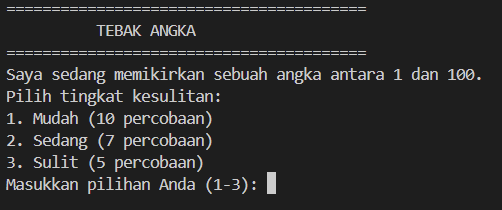
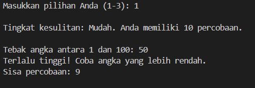
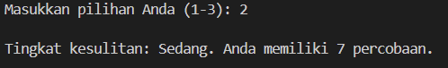
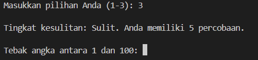

# Guess The Number

## Deskripsi Proyek
Guess The Number adalah skrip Python berbasis command-line (CLI) di mana pemain harus menebak sebuah angka yang dihasilkan secara acak dalam jumlah percobaan terbatas. Proyek ini menyelesaikan masalah mensimulasikan permainan tebak angka klasik secara digital, lengkap dengan sistem tingkat kesulitan dan petunjuk (hint) "terlalu tinggi" atau "terlalu rendah" di setiap tebakan.

## Tampilan Aplikasi

### Tampilan Awal

### Tampilan opsi 1

### Tampilan opsi 2

### Tampilan opsi 3

## Fitur Utama
- Angka target dihasilkan secara acak antara 1 sampai 100 di setiap ronde
- Tiga tingkat kesulitan (Easy, Medium, Hard) dengan jumlah percobaan yang berbeda-beda
- Petunjuk otomatis "Too low" atau "Too high" setelah setiap tebakan yang salah
- Validasi input agar pemain hanya bisa memasukkan angka yang valid dan berada dalam rentang yang ditentukan
- Penghitung sisa percobaan yang ditampilkan setelah setiap tebakan
- Mendukung bermain berulang kali (multiple rounds) dalam satu sesi program

## Teknologi yang Digunakan
- Python 3.x
- Modul `random`

## Arsitektur
Alur kerja skrip ini berjalan dalam satu loop permainan per ronde:
1. `choose_difficulty()` menampilkan tiga pilihan tingkat kesulitan beserta jumlah percobaan yang tersedia, lalu mengembalikan nama tingkat kesulitan dan batas percobaannya berdasarkan dictionary `DIFFICULTY_ATTEMPTS`.
2. `random.randint()` digunakan untuk menghasilkan angka target secara acak dalam rentang `MIN_NUMBER` sampai `MAX_NUMBER`.
3. `get_guess()` memvalidasi input pemain agar berupa angka yang valid dan berada dalam rentang yang ditentukan.
4. `give_hint()` membandingkan tebakan pemain dengan angka target, lalu menampilkan petunjuk apakah tebakan terlalu rendah atau terlalu tinggi.
5. Loop utama di `main()` terus berjalan hingga pemain berhasil menebak angka dengan benar atau kehabisan jumlah percobaan sesuai tingkat kesulitan yang dipilih.
6. Setelah satu ronde selesai, program menanyakan apakah pemain ingin bermain lagi dengan angka target dan tingkat kesulitan yang baru.

## Pembelajaran Spesifik
- Menggunakan dictionary (`DIFFICULTY_ATTEMPTS`) untuk memetakan pilihan tingkat kesulitan ke nama dan jumlah percobaannya, sehingga mudah ditambah atau diubah tanpa mengubah banyak bagian kode.
- Menerapkan `random.randint()` untuk menghasilkan angka acak dalam rentang tertentu sebagai target permainan.
- Memisahkan logika pemberian petunjuk (`give_hint`) dari logika utama permainan, sehingga kode lebih modular dan mudah dites secara terpisah.
- Merancang kondisi berhenti loop berdasarkan dua kemungkinan: tebakan benar (kemenangan) atau jumlah percobaan habis (kekalahan), sekaligus menampilkan sisa percobaan sebagai umpan balik real-time kepada pemain.
