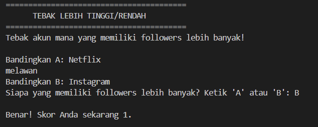

# Higher Lower Game

## Deskripsi Proyek
Higher Lower Game adalah skrip Python berbasis command-line (CLI) di mana pemain diperlihatkan dua item (dalam hal ini akun media sosial) dan harus menebak mana yang memiliki jumlah followers lebih banyak. Proyek ini menyelesaikan masalah mensimulasikan permainan tebak-menebak populer seperti "Higher Lower" secara digital, dengan skor yang terus bertambah selama pemain menebak dengan benar, dan permainan berakhir begitu pemain salah menebak.

## Tampilan Aplikasi

## Fitur Utama
- Daftar item (akun media sosial) beserta data jumlah followers yang digunakan untuk perbandingan
- Dua item dipilih secara acak dan tidak akan sama satu sama lain di setiap perbandingan
- Item pemenang dari ronde sebelumnya dipertahankan sebagai "Compare A" pada ronde berikutnya, sesuai mekanisme game Higher Lower yang sesungguhnya
- Validasi input agar pemain hanya bisa menebak "A" atau "B"
- Skor otomatis bertambah setiap kali tebakan benar, dan permainan berakhir begitu tebakan salah
- Menampilkan jumlah followers kedua item saat permainan berakhir sebagai bentuk transparansi hasil
- Mendukung bermain berulang kali (multiple sessions) dalam satu sesi program

## Teknologi yang Digunakan
- Python 3.x
- Modul `random`

## Arsitektur
Alur kerja skrip ini berjalan dalam satu loop permainan yang berlanjut selama pemain menebak dengan benar:
1. Data item disimpan sebagai list of dictionary (`ITEMS`), setiap dictionary berisi `name` dan `followers`.
2. `get_random_item()` memilih satu item secara acak, dengan opsi `exclude` untuk memastikan item yang dipilih berbeda dari item yang sudah tampil di ronde tersebut.
3. `print_items()` menampilkan kedua item yang akan dibandingkan tanpa membocorkan jumlah followers-nya.
4. `get_guess()` memvalidasi input pemain agar hanya berupa "A" atau "B".
5. `check_guess()` membandingkan jumlah followers kedua item untuk menentukan apakah tebakan pemain benar.
6. Jika tebakan benar, skor bertambah dan item yang menang pada ronde tersebut dijadikan "Compare A" untuk ronde berikutnya, sementara item baru dipilih secara acak sebagai "Compare B".
7. Jika tebakan salah, loop berhenti dan skor akhir beserta data followers kedua item terakhir ditampilkan ke layar.

## Pembelajaran Spesifik
- Menggunakan list of dictionary sebagai struktur data sederhana untuk menyimpan beberapa atribut per item (nama dan jumlah followers) sekaligus.
- Menerapkan parameter `exclude` pada fungsi `get_random_item()` untuk mencegah dua item yang sama muncul berdampingan dalam satu perbandingan.
- Memahami mekanisme "pemenang bertahan" (winner stays), yaitu memindahkan item yang menang ke posisi "Compare A" pada ronde berikutnya, mirip logika game Higher Lower yang sebenarnya.
- Mengelola state skor yang terus meningkat dalam sebuah loop `while True` hingga kondisi kekalahan tercapai, lalu menghentikan loop menggunakan `break`.
