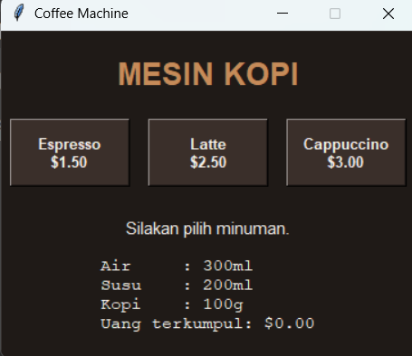
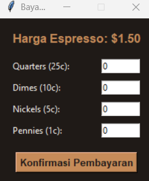

# Coffee Machine

## Deskripsi Proyek
Coffee Machine adalah aplikasi simulasi mesin kopi berbasis GUI (Graphical User Interface) yang dibangun menggunakan Tkinter dengan pendekatan OOP (Object-Oriented Programming). Pengguna dapat memilih salah satu dari tiga menu minuman, melakukan pembayaran menggunakan simulasi koin, dan menerima kembalian, layaknya mesin kopi otomatis sungguhan. Proyek ini menyelesaikan masalah mensimulasikan alur kerja mesin kopi nyata secara visual dan interaktif, lengkap dengan pengelolaan sumber daya dan pencatatan pendapatan.

## Tampilan Aplikasi

### Tampilan Awal

### Tampilan Harga

## Fitur Utama
- Tiga pilihan menu minuman (espresso, latte, cappuccino) masing-masing dengan harga dan kebutuhan bahan yang berbeda
- Antarmuka GUI interaktif dengan tombol menu dan jendela pembayaran terpisah
- Simulasi pembayaran menggunakan koin (quarters, dimes, nickels, pennies) beserta perhitungan kembalian otomatis
- Validasi otomatis apabila sumber daya (air, susu, atau kopi) tidak mencukupi untuk membuat pesanan
- Validasi otomatis apabila uang yang dimasukkan kurang dari harga minuman
- Laporan sumber daya dan pendapatan yang selalu diperbarui secara real-time setelah setiap transaksi
- Struktur kode berbasis OOP yang memisahkan tanggung jawab menu, mesin kopi, kotak uang, dan tampilan ke dalam class masing-masing

## Teknologi yang Digunakan
- Python 3.x
- Tkinter

## Arsitektur
Proyek ini dirancang dengan empat class utama yang saling terhubung mengikuti prinsip OOP:
1. **`MenuItem`** merepresentasikan satu jenis minuman beserta atribut harga dan kebutuhan bahannya (air, susu, kopi).
2. **`Menu`** menyimpan seluruh daftar `MenuItem` yang tersedia dan menyediakan method `find_item()` untuk mencari menu berdasarkan nama.
3. **`CoffeeMaker`** mengelola sumber daya mesin (air, susu, kopi), memeriksa kecukupan bahan lewat `is_resource_sufficient()`, mengurangi sumber daya lewat `make_coffee()`, dan menghasilkan laporan kondisi bahan lewat `report()`.
4. **`CashRegister`** menangani logika transaksi uang, menghitung total pembayaran dari koin lewat `calculate_total()`, memvalidasi dan memproses pembayaran lewat `process_payment()`, serta mencatat total pendapatan (profit).
5. **`CoffeeMachineApp`** menjadi class utama yang menghubungkan ketiga class di atas dengan antarmuka Tkinter. Class ini membangun tata letak (tombol menu, label status, label laporan) dan menangani interaksi pengguna, seperti membuka jendela pembayaran (`_open_payment_window()`) saat sebuah menu dipilih, lalu memperbarui laporan setelah transaksi berhasil.

Alur interaksinya: pengguna klik tombol menu → `CoffeeMachineApp` memeriksa kecukupan bahan lewat `CoffeeMaker` → jika cukup, jendela pembayaran terbuka → pengguna memasukkan jumlah koin → `CashRegister` menghitung total dan kembalian → jika pembayaran valid, `CoffeeMaker` mengurangi sumber daya dan laporan pada GUI diperbarui secara otomatis.

## Pembelajaran Spesifik
- Menerapkan pemisahan tanggung jawab dalam OOP dengan memecah logika bisnis seperti menu, sumber daya, dan transaksi ke dalam class-class terpisah dari logika tampilan, sehingga setiap class punya satu fokus yang jelas.
- Membangun antarmuka GUI menggunakan Tkinter, termasuk penggunaan `Toplevel` untuk membuat jendela pembayaran terpisah dari jendela utama tanpa mengganggu alur program.
- Menggunakan closure dan `lambda` di dalam loop (`command=lambda name=item.name: ...`) untuk memastikan setiap tombol menu memanggil fungsi dengan nama minuman yang benar, menghindari masalah late binding pada Python.
- Mengintegrasikan validasi input pengguna jika jumlah koin yang bukan angka, uang kurang dari harga dengan `messagebox` milik Tkinter agar pengguna mendapat umpan balik yang jelas tanpa membuat aplikasi crash.
- Merancang state aplikasi yang terus diperbarui secara real-time pada tampilan setiap kali terjadi transaksi berhasil, tanpa perlu me-restart ulang aplikasi.