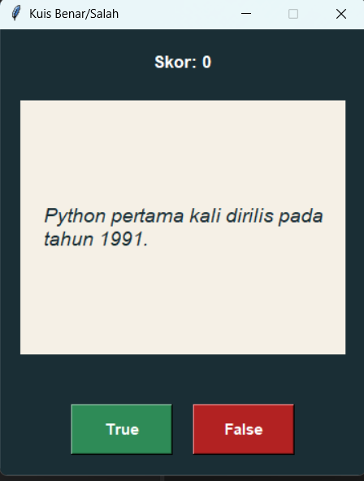

# Quiz Project

## Deskripsi Proyek
Quiz Project adalah aplikasi kuis trivia bertipe True/False berbasis GUI (Graphical User Interface) yang dibangun menggunakan Tkinter dengan pendekatan OOP (Object-Oriented Programming). Pengguna akan disajikan serangkaian pernyataan trivia satu per satu dan harus memilih True atau False, dengan skor yang diperbarui secara real-time setiap kali menjawab. Proyek ini menyelesaikan masalah mensimulasikan kuis interaktif digital lengkap dengan umpan balik visual langsung, alih-alih kuis statis berbasis teks biasa.

## Tampilan Aplikasi

## Fitur Utama
- Sepuluh pertanyaan trivia True/False yang ditampilkan satu per satu dalam bentuk kartu
- Dua tombol jawaban (True dan False) dengan warna berbeda agar mudah dibedakan
- Skor yang diperbarui secara otomatis dan real-time setelah setiap jawaban
- Umpan balik instan (benar/salah) beserta jawaban yang benar jika pengguna salah menjawab
- Transisi otomatis ke pertanyaan berikutnya setelah jeda singkat
- Tampilan skor akhir dan tombol jawaban otomatis dinonaktifkan saat seluruh pertanyaan sudah dijawab
- Struktur kode berbasis OOP yang memisahkan data pertanyaan, logika kuis, dan tampilan ke dalam class masing-masing

## Teknologi yang Digunakan
- Python 3.x
- Tkinter (bawaan Python, digunakan untuk membangun antarmuka GUI)

## Arsitektur
Proyek ini dirancang dengan tiga class utama yang saling terhubung mengikuti prinsip OOP:
1. **`Question`** merepresentasikan satu pertanyaan kuis, menyimpan teks pernyataan dan jawaban yang benar (`True`/`False`).
2. **`QuizBrain`** mengelola seluruh logika kuis: melacak nomor pertanyaan saat ini dan skor, menyediakan method `still_has_questions()` untuk mengecek apakah masih ada pertanyaan tersisa, `next_question()` untuk mengambil pertanyaan berikutnya, dan `check_answer()` untuk memvalidasi jawaban pengguna sekaligus menambah skor jika benar.
3. **`QuizInterface`** menjadi class utama yang membangun tampilan Tkinter (skor, kartu pertanyaan menggunakan `Canvas`, tombol True/False) dan menghubungkannya dengan `QuizBrain`. Class ini menangani seluruh interaksi pengguna, mulai dari menampilkan pertanyaan lewat `get_next_question()`, memproses jawaban lewat `answer_question()`, hingga menampilkan hasil akhir saat seluruh pertanyaan telah dijawab.

Alur interaksinya: aplikasi dimulai → `QuizInterface` meminta pertanyaan pertama dari `QuizBrain` → pengguna menekan tombol True/False → `QuizBrain` memvalidasi jawaban dan memperbarui skor → `QuizInterface` menampilkan umpan balik singkat → setelah jeda otomatis, pertanyaan berikutnya ditampilkan, hingga seluruh pertanyaan pada `QUESTION_DATA` habis.

## Pembelajaran Spesifik
- Memisahkan data (daftar pertanyaan), logika bisnis (`QuizBrain`), dan tampilan (`QuizInterface`) ke dalam class-class yang berbeda, sehingga setiap bagian dapat dikembangkan atau diuji secara independen.
- Menggunakan `Canvas` milik Tkinter untuk menampilkan teks pertanyaan dalam bentuk kartu visual, termasuk pengaturan `width` pada `create_text` agar teks panjang otomatis membungkus ke baris berikutnya.
- Menerapkan `root.after()` untuk menjalankan fungsi secara tertunda (delayed call), digunakan di sini untuk memberi jeda singkat sebelum berpindah ke pertanyaan berikutnya tanpa memblokir antarmuka pengguna.
- Mengelola state aplikasi (nomor pertanyaan dan skor) yang tersimpan di dalam class `QuizBrain`, terpisah dari komponen visual, sehingga logika kuis tetap konsisten meskipun tampilan terus diperbarui.
- Menonaktifkan tombol (`state="disabled"`) sebagai cara sederhana untuk mencegah interaksi lebih lanjut setelah kuis selesai, tanpa perlu menutup atau menghancurkan jendela aplikasi.