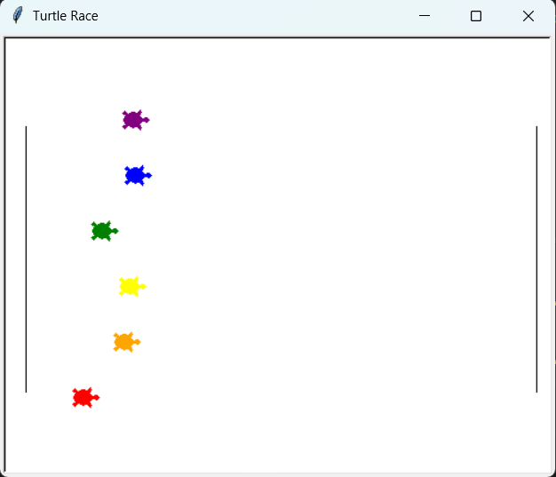

# Turtle Race

## Deskripsi Proyek
Turtle Race adalah simulasi balapan kura-kura berbasis GUI yang dibangun menggunakan modul `turtle` dengan pendekatan OOP (Object-Oriented Programming). Pengguna diminta menebak warna kura-kura mana yang akan memenangkan balapan, kemudian beberapa kura-kura berwarna akan bergerak maju secara acak hingga salah satu mencapai garis finis. Proyek ini menyelesaikan masalah mensimulasikan permainan tebak-tebakan berbasis animasi sederhana, di mana hasil akhirnya murni ditentukan oleh keacakan (randomness), mirip permainan tebak pemenang balapan yang populer sebagai latihan animasi dasar.

## Tampilan Aplikasi

## Fitur Utama
- Enam kura-kura dengan warna berbeda berbaris di garis start, masing-masing pada jalur (lane) terpisah
- Garis start dan garis finis digambar otomatis sebagai penanda visual balapan
- Kotak dialog interaktif untuk menebak warna pemenang sebelum balapan dimulai
- Pergerakan setiap kura-kura dihasilkan secara acak di setiap putaran animasi menggunakan `random.randint()`
- Balapan otomatis berhenti begitu salah satu kura-kura melewati garis finis
- Hasil akhir menampilkan apakah tebakan pengguna benar atau salah, beserta warna kura-kura pemenang
- Struktur kode berbasis OOP yang membungkus seluruh logika balapan ke dalam satu class `TurtleRace`

## Teknologi yang Digunakan
- Python 3.x
- Modul `turtle` dan `random` (keduanya bawaan Python, tidak perlu instalasi tambahan)

## Arsitektur
Seluruh logika balapan dibungkus dalam satu class utama, `TurtleRace`, yang method-methodnya menangani setiap tahapan:
1. `setup_screen()` menyiapkan jendela permainan beserta ukuran dan warna latar belakangnya.
2. `draw_track_lines()` menggambar garis start dan garis finis menggunakan turtle terpisah yang berfungsi sebagai "penanda" (marker), tanpa ikut serta dalam balapan.
3. `create_racers()` membuat satu objek `Turtle` untuk setiap warna pada `COLORS`, menempatkannya pada posisi start yang terbagi rata secara vertikal (lane), lalu menyimpannya ke dalam list `self.racers`.
4. `ask_user_guess()` menampilkan kotak dialog input bawaan turtle (`textinput`) untuk meminta tebakan warna dari pengguna.
5. `run_race()` menjalankan loop utama animasi: setiap kura-kura bergerak maju dengan jarak acak di setiap putaran, hingga salah satu kura-kura melewati `FINISH_LINE_X`, yang kemudian disimpan sebagai `self.winner`.
6. `show_result()` membandingkan tebakan pengguna dengan pemenang sesungguhnya, lalu menampilkan pesan hasil yang sesuai melalui kotak dialog.
7. `start()` menjadi method orkestrator yang memanggil seluruh method di atas secara berurutan, dari setup hingga penutupan jendela (`screen.bye()`).

## Pembelajaran Spesifik
- Membungkus seluruh state balapan (daftar kura-kura, pemenang, layar) ke dalam atribut sebuah class, sehingga setiap method dapat saling berbagi data tanpa perlu variabel global.
- Menggunakan `turtle.textinput()` sebagai cara sederhana untuk menampilkan kotak dialog input maupun pesan hasil, tanpa perlu membangun GUI tambahan seperti Tkinter secara terpisah.
- Menerapkan logika "lomba acak" dengan memberi setiap turtle jarak langkah acak di setiap iterasi, sehingga hasil balapan benar-benar tidak dapat diprediksi di awal program.
- Memahami penggunaan `xcor()` untuk membaca posisi horizontal sebuah turtle, yang menjadi dasar penentuan kondisi kemenangan (saat posisi melewati garis finis).
- Merancang method `start()` sebagai satu titik masuk tunggal yang mengatur urutan eksekusi seluruh tahapan balapan, membuat alur program mudah diikuti meskipun logikanya tersebar di beberapa method berbeda.