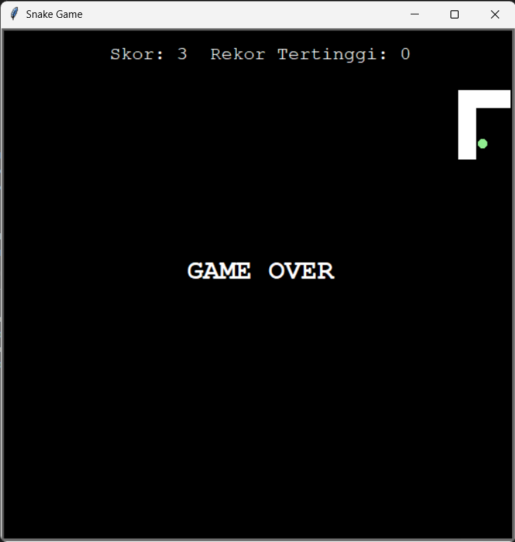

# Snake Game

## Deskripsi Proyek
Snake Game adalah replika permainan ular klasik berbasis GUI yang dibangun menggunakan modul `turtle` dengan pendekatan OOP (Object-Oriented Programming). Pemain mengendalikan pergerakan ular menggunakan tombol panah untuk memakan makanan yang muncul secara acak, membuat ular bertambah panjang dan skor meningkat, sambil menghindari tabrakan dengan dinding layar maupun tubuhnya sendiri. Proyek ini menyelesaikan masalah mensimulasikan game arcade klasik secara lengkap, termasuk deteksi tabrakan, sistem skor, dan rekor tertinggi (high score) dalam satu sesi permainan.

## Tampilan Aplikasi

## Fitur Utama
- Kendali ular menggunakan empat tombol panah (atas, bawah, kiri, kanan)
- Pencegahan ular berbalik arah 180 derajat secara instan (misalnya langsung dari kanan ke kiri)
- Makanan muncul di posisi acak setiap kali berhasil dimakan oleh ular
- Ular bertambah panjang satu segmen setiap kali memakan makanan
- Sistem skor yang meningkat otomatis dan ditampilkan secara real-time di bagian atas layar
- Pelacakan rekor tertinggi (high score) yang diperbarui jika skor pada sesi saat ini melampauinya
- Deteksi tabrakan dengan dinding layar dan dengan tubuh ular itu sendiri, yang keduanya mengakhiri permainan
- Tampilan "GAME OVER" otomatis saat permainan berakhir
- Struktur kode berbasis OOP dengan empat class terpisah: `Snake`, `Food`, `Scoreboard`, dan `SnakeGame`

## Teknologi yang Digunakan
- Python 3.x
- Modul `turtle`, `random`, dan `time`

## Arsitektur
Proyek ini dirancang dengan empat class utama yang masing-masing memiliki tanggung jawab berbeda:
1. **`Snake`** mengelola seluruh tubuh ular sebagai list segmen turtle. Method `create_snake()` membangun segmen awal, `add_segment()` menambah satu segmen baru, `extend()` memperpanjang ular saat makan, `move()` menggerakkan setiap segmen mengikuti segmen di depannya (teknik umum animasi ular), dan method arah (`up`, `down`, `left`, `right`) mengatur heading kepala ular sambil mencegah ular berbalik langsung ke arah berlawanan.
2. **`Food`** merupakan turunan langsung dari `turtle.Turtle` (inheritance), merepresentasikan makanan berbentuk lingkaran kecil yang dapat memindahkan dirinya sendiri ke posisi acak lewat method `refresh()`.
3. **`Scoreboard`** juga merupakan turunan dari `turtle.Turtle`, bertanggung jawab menampilkan teks skor dan rekor tertinggi di layar, menambah skor lewat `increase_score()`, serta menampilkan pesan "GAME OVER" dan memperbarui rekor tertinggi lewat `game_over()`.
4. **`SnakeGame`** menjadi class orkestrator yang menyiapkan layar, menghubungkan ketiga class di atas, mendaftarkan kontrol keyboard (`_setup_controls()`), serta menjalankan loop utama permainan (`run()`) yang terus menggerakkan ular dan memeriksa tiga jenis tabrakan (makanan, dinding, dan tubuh sendiri) di setiap iterasi.

## Pembelajaran Spesifik
- Menerapkan konsep inheritance (pewarisan) dengan menjadikan `Food` dan `Scoreboard` sebagai subclass dari `turtle.Turtle`, sehingga kedua class tersebut otomatis mewarisi seluruh kemampuan turtle tanpa perlu menulis ulang logikanya.
- Memahami teknik animasi ular klasik, yaitu menggerakkan setiap segmen tubuh ke posisi segmen di depannya secara berurutan dari belakang ke depan, sebelum akhirnya menggerakkan kepala ke posisi baru.
- Menggunakan `screen.tracer(0)` bersama `screen.update()` untuk mengambil alih kontrol animasi secara manual, menghasilkan pergerakan yang lebih halus dan dapat dikendalikan kecepatannya dibandingkan animasi otomatis bawaan turtle.
- Menerapkan deteksi tabrakan sederhana menggunakan method `distance()` antar objek turtle, baik untuk mendeteksi tabrakan dengan makanan, dinding (berdasarkan batas koordinat), maupun segmen tubuh sendiri.
- Mencegah bug umum pada game Snake, yaitu ular yang bisa langsung menabrak dirinya sendiri karena berbalik 180 derajat, dengan memeriksa `heading()` saat ini sebelum mengizinkan perubahan arah.