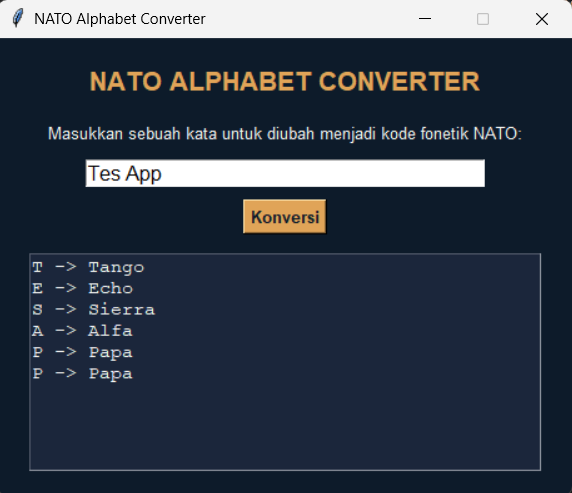

# NATO Alphabet Project

## Deskripsi Proyek
NATO Alphabet Project adalah aplikasi GUI yang mengubah kata yang dimasukkan pengguna menjadi kode alfabet fonetik NATO (contoh: "Hi" menjadi "Hotel India"), dibangun menggunakan Tkinter dengan pendekatan OOP (Object-Oriented Programming). Proyek ini menyelesaikan masalah mengeja kata secara jelas dan tidak ambigu melalui komunikasi suara (seperti telepon atau radio), dengan memanfaatkan standar alfabet fonetik yang umum digunakan di dunia penerbangan dan militer.

## Tampilan Aplikasi

## Fitur Utama
- Konversi otomatis setiap huruf dalam kata menjadi kode fonetik NATO yang sesuai
- Mendukung input dengan huruf besar maupun kecil (tidak case-sensitive)
- Mengabaikan spasi antar kata secara otomatis tanpa menimbulkan error
- Mendeteksi dan menampilkan karakter yang bukan huruf (seperti angka atau tanda baca) sebagai catatan terpisah, tanpa menghentikan proses konversi
- Validasi input kosong dengan pesan peringatan menggunakan `messagebox`
- Mendukung konversi langsung dengan menekan tombol Enter selain tombol "Konversi"
- Hasil konversi ditampilkan rapi per baris dalam kotak output, menunjukkan pasangan huruf asli dan kode fonetiknya

## Teknologi yang Digunakan
- Python 3.x
- Tkinter

## Arsitektur
Proyek ini dirancang dengan dua class utama yang saling terhubung mengikuti prinsip OOP:
1. **`NatoConverter`** menyimpan data alfabet fonetik NATO dalam bentuk dictionary (`nato_alphabet`) yang memetakan setiap huruf ke kode fonetiknya. Method `convert_word()` melakukan iterasi terhadap setiap karakter dalam kata input, memisahkan karakter yang valid (huruf) ke dalam pasangan (huruf, kode fonetik), sementara karakter yang tidak valid (bukan huruf dan bukan spasi) dikumpulkan secara terpisah untuk dilaporkan ke pengguna.
2. **`NatoApp`** menjadi class utama yang membangun tampilan Tkinter (judul, kotak input, tombol konversi, kotak output) dan menghubungkannya dengan `NatoConverter`. Method `handle_convert()` dipicu saat tombol ditekan atau tombol Enter digunakan, mengambil input dari pengguna, memanggil `convert_word()`, lalu memformat dan menampilkan hasilnya melalui `_display_output()`.

Alur interaksinya: pengguna mengetik sebuah kata → menekan tombol "Konversi" atau Enter → `NatoApp` memvalidasi bahwa input tidak kosong → `NatoConverter.convert_word()` memproses kata menjadi pasangan huruf-kode fonetik sekaligus mendeteksi karakter tidak valid → hasil akhir ditampilkan di kotak output, termasuk catatan karakter yang diabaikan jika ada.

## Pembelajaran Spesifik
- Menggunakan dictionary sebagai struktur data yang tepat untuk pemetaan satu-ke-satu (huruf ke kode fonetik), membuat proses pencarian (lookup) menjadi sangat efisien dengan kompleksitas O(1).
- Memisahkan logika konversi data (`NatoConverter`) dari logika tampilan (`NatoApp`), sehingga fungsi konversi dapat diuji atau digunakan kembali secara independen tanpa bergantung pada Tkinter.
- Menangani input yang tidak sepenuhnya valid (karakter non-huruf) secara graceful, yaitu tetap melanjutkan proses konversi untuk karakter yang valid sambil memberi tahu pengguna karakter mana saja yang diabaikan, alih-alih langsung menolak seluruh input.
- Menggunakan `Entry.bind("<Return>", ...)` untuk mendaftarkan event keyboard, memungkinkan pengguna memicu aksi yang sama baik lewat klik tombol maupun menekan Enter, demi pengalaman pengguna yang lebih nyaman.
- Mengatur widget `Text` menjadi `state="disabled"` setelah diisi agar hasil output bersifat read-only, mencegah pengguna secara tidak sengaja mengedit teks hasil konversi.