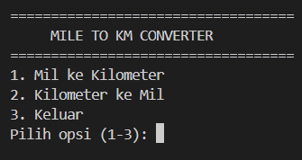

# Mile to KM Converter

## Deskripsi Proyek
Mile to KM Converter adalah skrip Python berbasis command-line (CLI) yang mengonversi jarak dari satuan mil ke kilometer, maupun sebaliknya dari kilometer ke mil. Proyek ini menyelesaikan masalah konversi satuan jarak yang sering dibutuhkan saat membaca data dari sumber yang menggunakan sistem satuan berbeda (imperial vs metrik), tanpa perlu mencari kalkulator konversi secara manual.

## Tampilan Aplikasi

## Fitur Utama
- Konversi dua arah: mil ke kilometer dan kilometer ke mil
- Menggunakan nilai konstanta konversi yang akurat (1 mil = 1.60934 km)
- Validasi input agar pengguna hanya bisa memasukkan angka yang valid dan bernilai 0 atau lebih besar
- Menu interaktif berbasis pilihan angka yang bisa digunakan berulang kali dalam satu sesi program
- Hasil konversi ditampilkan dengan pembulatan dua angka desimal agar mudah dibaca

## Teknologi yang Digunakan
- Python 3.x

## Arsitektur
Alur kerja skrip ini berbasis menu pilihan yang berjalan dalam loop:
1. `print_menu()` menampilkan tiga pilihan: konversi mil ke km, konversi km ke mil, atau keluar.
2. `get_distance()` memvalidasi input pengguna agar berupa angka yang valid dan tidak bernilai negatif.
3. `miles_to_km()` dan `km_to_miles()` masing-masing melakukan perhitungan konversi menggunakan konstanta `MILE_TO_KM` sebagai faktor pengali atau pembagi.
4. Program terus menampilkan menu dan memproses pilihan pengguna hingga opsi "Keluar" dipilih.

## Pembelajaran Spesifik
- Memahami pentingnya menyimpan nilai konstanta (seperti faktor konversi) sebagai variabel bernama (`MILE_TO_KM`) di bagian atas skrip, agar mudah ditemukan dan diubah tanpa perlu menelusuri seluruh kode.
- Menerapkan dua fungsi konversi yang saling berkebalikan (`miles_to_km` dan `km_to_miles`) menggunakan operasi perkalian dan pembagian dari konstanta yang sama, menghindari duplikasi nilai konversi.
- Membiasakan validasi input numerik dasar (menolak angka negatif dan input yang bukan angka) sebagai praktik umum sebelum melakukan perhitungan lebih lanjut.
- Merancang program CLI sederhana tanpa pendekatan OOP, karena kompleksitas logika yang rendah pada proyek ini lebih cocok diselesaikan dengan fungsi-fungsi kecil yang langsung menuju inti permasalahan.