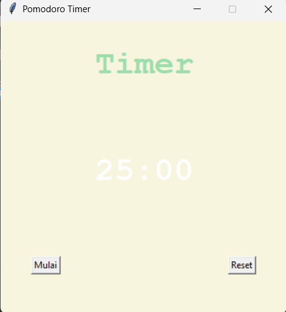

# Pomodoro Timer

## Deskripsi Proyek
Pomodoro Timer adalah aplikasi GUI yang menerapkan teknik manajemen waktu Pomodoro, dibangun menggunakan Tkinter dengan pendekatan OOP (Object-Oriented Programming). Aplikasi ini membantu pengguna bekerja dalam sesi fokus 25 menit yang diselingi istirahat pendek (5 menit), dengan istirahat panjang (20 menit) setelah menyelesaikan empat sesi kerja. Proyek ini menyelesaikan masalah menjaga fokus dan produktivitas kerja menggunakan siklus waktu yang terstruktur, lengkap dengan hitung mundur visual dan pelacakan jumlah sesi yang telah diselesaikan.

## Tampilan Aplikasi

## Fitur Utama
- Siklus Pomodoro otomatis: sesi kerja 25 menit, istirahat pendek 5 menit, dan istirahat panjang 20 menit setiap 4 sesi kerja
- Hitung mundur visual yang ditampilkan di tengah layar, diperbarui setiap detik
- Judul dan warna tampilan berubah otomatis sesuai jenis sesi yang sedang berjalan (kerja, istirahat pendek, atau istirahat panjang)
- Penghitung jumlah sesi kerja yang telah berhasil diselesaikan, ditampilkan sebagai teks di bawah timer
- Tombol Mulai yang otomatis nonaktif setelah ditekan untuk mencegah beberapa timer berjalan bersamaan
- Tombol Reset yang mengembalikan seluruh tampilan dan progres ke kondisi awal
- Struktur kode berbasis OOP yang memisahkan logika timer (`PomodoroTimer`) dari tampilan antarmuka (`PomodoroApp`)

## Teknologi yang Digunakan
- Python 3.x
- Tkinter (bawaan Python, digunakan untuk membangun antarmuka GUI)
- Modul `math` (bawaan Python, digunakan untuk menghitung format menit dan detik)

## Arsitektur
Proyek ini dirancang dengan dua class utama yang saling terhubung namun tetap terpisah secara tanggung jawab:
1. **`PomodoroTimer`** menangani seluruh logika murni timer tanpa bergantung langsung pada Tkinter. Method `_get_next_session()` menentukan jenis sesi berikutnya berdasarkan jumlah repetisi (`reps`) yang sudah dijalankan, sementara `_count_down()` menjalankan hitung mundur secara rekursif detik demi detik. Class ini menerima dua fungsi callback dari luar (`on_tick` dan `on_session_complete`) serta fungsi penjadwal (`set_scheduler()`), sehingga logikanya tetap dapat diuji secara independen dari GUI.
2. **`PomodoroApp`** menjadi class utama yang membangun tampilan Tkinter (judul, canvas timer, tombol, label checkmark sesi) dan menghubungkannya dengan `PomodoroTimer` melalui fungsi callback. Method `_update_title()` dan `_update_canvas()` memperbarui tampilan setiap detik, sementara `_handle_session_complete()` menangani transisi otomatis ke sesi berikutnya begitu hitung mundur mencapai nol.

Alur interaksinya: pengguna menekan tombol Mulai → `PomodoroApp` memanggil `PomodoroTimer.start_next_session()` → `PomodoroTimer` menentukan jenis sesi dan menjalankan hitung mundur menggunakan `root.after()` yang dijadwalkan lewat `set_scheduler()` → setiap detik, callback `on_tick` memperbarui judul dan canvas → saat mencapai nol, `on_session_complete` dipanggil untuk mencatat sesi kerja yang selesai (jika relevan) dan otomatis memulai sesi berikutnya.

## Pembelajaran Spesifik
- Memisahkan logika murni (timer, penghitungan sesi) dari logika tampilan menggunakan pola callback, sehingga `PomodoroTimer` tidak perlu mengetahui apa pun tentang Tkinter dan dapat diuji atau digunakan kembali di konteks lain.
- Menerapkan rekursi menggunakan `root.after()` untuk membuat efek hitung mundur, di mana setiap detik fungsi memanggil dirinya sendiri kembali dengan nilai detik yang berkurang satu, alih-alih menggunakan loop `while` yang akan memblokir antarmuka GUI.
- Memahami cara membatalkan job terjadwal dari `root.after()` menggunakan `root.after_cancel()`, yang krusial agar fitur Reset benar-benar menghentikan hitung mundur yang sedang berjalan, bukan hanya menyembunyikannya dari tampilan.
- Menggunakan operasi modulo (`%`) untuk menentukan pola siklus sesi (kerja - istirahat pendek - kerja - istirahat pendek - ... - istirahat panjang) berdasarkan jumlah repetisi yang sudah berjalan.
- Mengelola state tombol (`state="disabled"` / `"normal"`) sebagai cara sederhana mencegah pengguna memicu beberapa timer berjalan bersamaan akibat menekan tombol Mulai berulang kali.