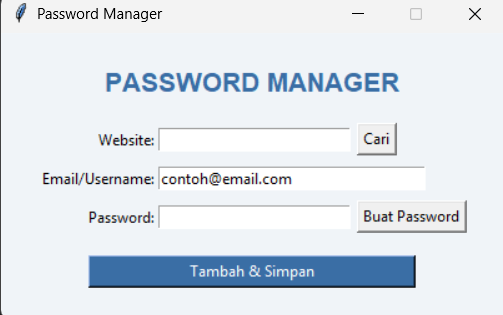

# Password Manager

## Deskripsi Proyek
Password Manager adalah aplikasi GUI untuk mengelola data login (website, email, dan password), dibangun menggunakan Tkinter dengan pendekatan OOP (Object-Oriented Programming). Pengguna dapat membuat password acak yang kuat, menyimpan data login ke dalam file JSON lokal, dan mencarinya kembali kapan saja berdasarkan nama website. Proyek ini menyelesaikan masalah mengingat banyak kombinasi username dan password untuk berbagai situs, dengan menyediakan satu tempat penyimpanan terpusat yang sederhana dan dapat diakses secara lokal.

## Tampilan Aplikasi

## Fitur Utama
- Pembuatan password acak yang kuat, mengombinasikan huruf besar/kecil, angka, dan simbol secara acak
- Penyimpanan data login (website, email, password) ke dalam file `data.json` secara lokal
- Pencarian data login berdasarkan nama website, ditampilkan melalui kotak dialog
- Konfirmasi sebelum menyimpan data untuk mencegah kesalahan input yang tidak disengaja
- Validasi otomatis apabila ada kolom yang masih kosong saat akan menyimpan data
- Penanganan kasus website yang belum pernah disimpan maupun file data yang belum ada atau rusak
- Kolom email terisi otomatis dengan contoh teks untuk mempercepat pengisian data berulang
- Struktur kode berbasis OOP yang memisahkan logika pembuatan password, penyimpanan data, dan tampilan ke dalam class masing-masing

## Teknologi yang Digunakan
- Python 3.x
- Tkinter (bawaan Python, digunakan untuk membangun antarmuka GUI)
- Modul `json`, `random`, dan `os` (bawaan Python, tidak perlu instalasi tambahan)

## Arsitektur
Proyek ini dirancang dengan tiga class utama yang saling terhubung mengikuti prinsip OOP:
1. **`PasswordGenerator`** bertanggung jawab menghasilkan password acak lewat method `generate()`, yang mengombinasikan sejumlah huruf, angka, dan simbol secara acak menggunakan `random.choice()`, lalu mengacak urutannya dengan `random.shuffle()` agar pola password tidak mudah ditebak.
2. **`PasswordVault`** menangani seluruh interaksi dengan file penyimpanan (`data.json`). Method `_load_data()` membaca data yang sudah ada (atau mengembalikan dictionary kosong jika file belum ada atau rusak), `save_entry()` menambahkan atau memperbarui entri berdasarkan nama website, dan `find_entry()` mencari entri tertentu untuk ditampilkan kembali ke pengguna.
3. **`PasswordManagerApp`** menjadi class utama yang membangun tampilan Tkinter (kolom website, email, password, serta tombol-tombol aksi) dan menghubungkannya dengan `PasswordGenerator` dan `PasswordVault`. Method `generate_password()` mengisi kolom password secara otomatis, `save_password()` memvalidasi dan menyimpan data melalui `PasswordVault`, dan `search_entry()` mengambil kembali data yang tersimpan berdasarkan nama website yang dicari.

Alur interaksinya: pengguna mengisi website dan email, lalu dapat menekan "Buat Password" untuk menghasilkan password acak secara otomatis → menekan "Tambah & Simpan" memicu `PasswordManagerApp` memvalidasi kelengkapan data, menampilkan konfirmasi, lalu menyimpannya lewat `PasswordVault.save_entry()` → untuk mengambil data lama, pengguna cukup mengisi nama website dan menekan "Cari", yang akan memanggil `PasswordVault.find_entry()` dan menampilkan hasilnya lewat kotak dialog.

## Pembelajaran Spesifik
- Menggunakan format JSON sebagai metode penyimpanan data sederhana yang mudah dibaca manusia maupun diproses ulang oleh program, tanpa memerlukan database eksternal.
- Menerapkan penanganan error (`try-except`) saat membaca file JSON untuk mengantisipasi kasus file belum ada atau formatnya rusak, sehingga aplikasi tidak crash saat pertama kali dijalankan.
- Memisahkan logika pembuatan password (`PasswordGenerator`) dan logika penyimpanan data (`PasswordVault`) ke dalam class independen, sehingga masing-masing dapat dikembangkan atau diuji tanpa bergantung pada kode antarmuka GUI.
- Menggunakan `messagebox.askyesno()` untuk meminta konfirmasi pengguna sebelum melakukan aksi yang mengubah data (menyimpan), sebagai praktik baik dalam desain antarmuka agar pengguna tidak salah menyimpan data secara tidak sengaja.
- Memahami penggunaan `os.path` untuk menentukan lokasi file data secara relatif terhadap lokasi skrip (`main.py`), sehingga file `data.json` selalu tersimpan di folder proyek yang sama meskipun program dijalankan dari direktori kerja yang berbeda.