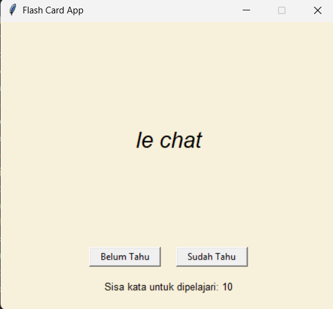

# Flash Card App

## Deskripsi Proyek
Flash Card App adalah aplikasi kartu hafalan kosakata Bahasa Prancis-Inggris berbasis GUI, dibangun menggunakan Tkinter dengan pendekatan OOP (Object-Oriented Programming). Setiap kartu menampilkan kata dalam Bahasa Prancis, lalu otomatis berbalik menampilkan terjemahan Bahasa Inggrisnya setelah beberapa detik. Pengguna dapat menandai kata sebagai "Sudah Tahu" untuk menghapusnya dari daftar hafalan, atau "Belum Tahu" agar kata tersebut muncul kembali di kemudian hari. Proyek ini menyelesaikan masalah menghafal kosakata asing secara efektif menggunakan metode spaced repetition sederhana, lengkap dengan progres belajar yang tersimpan otomatis antar sesi.

## Tampilan Aplikasi

## Fitur Utama
- Kartu hafalan yang menampilkan kata Bahasa Prancis terlebih dahulu, lalu otomatis membalik ke terjemahan Bahasa Inggris setelah 3 detik
- Dataset kosakata bawaan berisi 10 kata dasar Bahasa Prancis-Inggris
- Tombol "Sudah Tahu" untuk menghapus kata dari daftar hafalan secara permanen
- Tombol "Belum Tahu" untuk memindahkan kata ke akhir antrean agar muncul kembali nanti, bukan dihapus
- Progres hafalan tersimpan otomatis ke file `words_to_learn.csv`, sehingga sesi belajar dapat dilanjutkan kembali di lain waktu tanpa mengulang dari awal
- Penghitung sisa kata yang masih perlu dipelajari, ditampilkan secara real-time
- Pesan selamat otomatis serta penonaktifan tombol saat seluruh kata telah berhasil dikuasai
- Struktur kode berbasis OOP yang memisahkan pengelolaan data (`FlashcardData`) dari tampilan antarmuka (`FlashcardApp`)

## Teknologi yang Digunakan
- Python 3.x
- Tkinter (bawaan Python, digunakan untuk membangun antarmuka GUI)
- Modul `csv` dan `os` (bawaan Python, digunakan untuk menyimpan dan membaca progres belajar)

## Arsitektur
Proyek ini dirancang dengan dua class utama yang saling terhubung mengikuti prinsip OOP:
1. **`FlashcardData`** menangani seluruh pengelolaan data kosakata. Method `_load_words()` memuat progres dari file `words_to_learn.csv` jika tersedia, atau menggunakan dataset bawaan (`DEFAULT_WORDS`) jika belum ada progres tersimpan. Method `save_progress()` menulis ulang seluruh kata yang tersisa ke file CSV, `remove_word()` menghapus satu kata dari daftar saat sudah dikuasai, dan `has_words()` mengecek apakah masih ada kata yang tersisa untuk dipelajari.
2. **`FlashcardApp`** menjadi class utama yang membangun tampilan Tkinter (kartu menggunakan `Canvas`, tombol aksi, label progres) dan menghubungkannya dengan `FlashcardData`. Method `next_card()` mengambil kata pertama dari antrean dan menampilkannya, `_show_front()` dan `_show_back()` mengatur tampilan sisi depan dan belakang kartu, sementara `mark_know()` dan `mark_dont_know()` menangani aksi pengguna terhadap kata yang sedang ditampilkan.

Alur interaksinya: aplikasi dimulai → `FlashcardApp` meminta kata pertama dari `FlashcardData` → kartu menampilkan sisi Prancis, lalu otomatis berbalik ke sisi Inggris setelah jeda 3 detik menggunakan `root.after()` → jika pengguna menekan "Sudah Tahu", kata dihapus permanen dan progres disimpan ke CSV; jika menekan "Belum Tahu", kata dipindahkan ke akhir antrean agar muncul kembali → proses berulang hingga seluruh kata pada antrean berhasil dikuasai.

## Pembelajaran Spesifik
- Menerapkan penyimpanan progres sederhana menggunakan format CSV lewat modul `csv.DictReader` dan `csv.DictWriter`, memungkinkan data kosakata dibaca dan ditulis ulang dengan struktur kolom yang konsisten.
- Memahami pola "load jika ada, gunakan default jika tidak", sebuah teknik umum untuk memberi pengalaman awal yang baik bagi pengguna baru sekaligus tetap mendukung keberlanjutan progres bagi pengguna lama.
- Menggunakan `root.after()` untuk menjadwalkan pembalikan kartu secara otomatis, serta `root.after_cancel()` untuk membatalkan jadwal pembalikan sebelumnya saat kartu baru ditampilkan, mencegah tampilan kartu lama tiba-tiba berbalik di waktu yang salah.
- Merancang mekanisme antrean sederhana menggunakan `list.pop(0)` dan `list.append()` untuk memindahkan kata yang belum dikuasai ke akhir antrean, sebuah pendekatan dasar yang mirip dengan prinsip spaced repetition pada aplikasi hafalan sungguhan.
- Memisahkan logika pengelolaan data dari logika tampilan, sehingga `FlashcardData` dapat diuji secara independen (misalnya memverifikasi proses simpan dan muat ulang data) tanpa perlu menjalankan antarmuka GUI sama sekali.