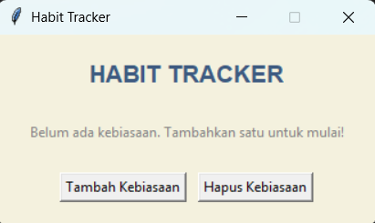

# Habit Tracking

## Deskripsi Proyek
Habit Tracking adalah aplikasi GUI untuk melacak kebiasaan harian, dibangun menggunakan Tkinter dengan pendekatan OOP (Object-Oriented Programming). Pengguna dapat menambahkan kebiasaan yang ingin dibangun, menandainya selesai setiap hari, dan melihat streak (rentetan hari berturut-turut) sebagai motivasi untuk tetap konsisten. Proyek ini menyelesaikan masalah menjaga konsistensi dalam membangun kebiasaan baik, dengan memberikan umpan balik visual langsung berupa hitungan streak yang terus bertambah selama kebiasaan dilakukan tanpa putus.

## Tampilan Aplikasi

## Fitur Utama
- Menambahkan kebiasaan baru yang ingin dilacak secara bebas sesuai kebutuhan pengguna
- Menandai kebiasaan sebagai selesai untuk hari ini dengan satu klik tombol
- Perhitungan streak otomatis: bertambah jika kebiasaan dilakukan berturut-turut setiap hari, dan kembali ke 1 jika ada hari yang terlewat
- Tombol "Tandai Selesai" otomatis nonaktif setelah kebiasaan ditandai selesai pada hari yang sama, mencegah penghitungan ganda
- Penghapusan kebiasaan yang sudah tidak ingin dilacak lagi
- Progres tersimpan otomatis ke file `habits.json`, sehingga data tetap ada meskipun aplikasi ditutup dan dibuka kembali
- Struktur kode berbasis OOP yang memisahkan logika penyimpanan data (`HabitStore`) dari tampilan antarmuka (`HabitTrackerApp`)

## Teknologi yang Digunakan
- Python 3.x
- Tkinter
- Modul `json`, `os`, dan `datetime`

## Arsitektur
Proyek ini dirancang dengan dua class utama yang saling terhubung mengikuti prinsip OOP:
1. **`HabitStore`** menangani seluruh pengelolaan data kebiasaan. Method `_load_data()` dan `_save_data()` membaca dan menulis data ke file `habits.json`, `add_habit()` dan `remove_habit()` mengelola daftar kebiasaan, sementara `mark_done_today()` berisi logika inti perhitungan streak: membandingkan tanggal penyelesaian terakhir dengan hari ini dan kemarin untuk menentukan apakah streak harus bertambah, direset ke 1, atau tidak berubah sama sekali (jika sudah ditandai hari ini).
2. **`HabitTrackerApp`** menjadi class utama yang membangun tampilan Tkinter dan menghubungkannya dengan `HabitStore`. Method `refresh_list()` menggambar ulang seluruh baris kebiasaan beserta streak dan status tombolnya setiap kali ada perubahan data, sementara `add_habit()`, `remove_habit()`, dan `mark_done()` menangani masing-masing aksi pengguna.

Alur interaksinya: pengguna menekan "Tambah Kebiasaan" dan mengisi nama lewat dialog → `HabitStore` menyimpannya ke `habits.json` → setiap hari, pengguna menekan "Tandai Selesai" pada kebiasaan yang telah dilakukan → `HabitStore.mark_done_today()` memperbarui streak sesuai aturan → `HabitTrackerApp.refresh_list()` menggambar ulang tampilan untuk mencerminkan streak terbaru.

## Pembelajaran Spesifik
- Merancang logika streak berbasis perbandingan tanggal (hari ini vs kemarin vs tanggal terakhir selesai), sebuah pola umum pada aplikasi pelacak kebiasaan maupun aplikasi gamifikasi lainnya.
- Menggunakan `date.today()` dan `timedelta` dari modul `datetime` untuk melakukan operasi aritmatika tanggal (menghitung "kemarin") tanpa perlu menghitung manual kasus akhir bulan atau akhir tahun.
- Menerapkan pola render ulang (`refresh_list()`) yang menghapus seluruh widget lama sebelum menggambar ulang dari data terbaru, pendekatan sederhana untuk menjaga tampilan selalu sinkron dengan state data, meskipun kurang efisien dibandingkan update parsial untuk aplikasi berskala besar.
- Menggunakan `simpledialog.askstring()` sebagai cara ringan untuk meminta input teks singkat dari pengguna tanpa perlu membangun jendela form tambahan secara manual.
- Mencegah bug logika umum (penghitungan ganda) dengan menonaktifkan tombol aksi begitu kondisinya sudah terpenuhi untuk hari ini, alih-alih hanya mengandalkan validasi di belakang layar.

