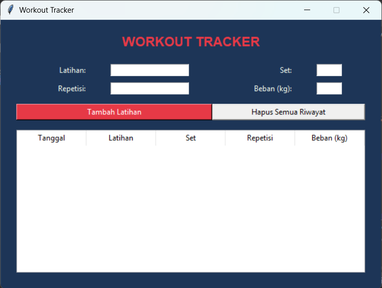

# Workout Tracking

## Deskripsi Proyek
Workout Tracking adalah aplikasi GUI untuk mencatat riwayat latihan fisik, dibangun menggunakan Tkinter dengan pendekatan OOP (Object-Oriented Programming). Pengguna dapat mencatat setiap sesi latihan (nama latihan, jumlah set, repetisi, dan beban), dan melihat seluruh riwayatnya dalam bentuk tabel yang rapi. Proyek ini menyelesaikan masalah mencatat progres latihan secara manual di buku atau catatan terpisah, dengan menyediakan satu aplikasi terpusat yang menyimpan riwayat secara otomatis dan dapat ditinjau kapan saja.

## Tampilan Aplikasi

## Fitur Utama
- Formulir input untuk mencatat nama latihan, jumlah set, repetisi, dan beban (kg)
- Tanggal pencatatan ditambahkan secara otomatis sesuai tanggal hari ini
- Validasi input: seluruh kolom wajib diisi, set dan repetisi harus berupa angka bulat, beban harus berupa angka
- Riwayat latihan ditampilkan dalam tabel (`Treeview`) yang rapi dengan kolom tanggal, latihan, set, repetisi, dan beban
- Data terbaru selalu ditampilkan di baris paling atas agar mudah dipantau
- Opsi untuk menghapus seluruh riwayat latihan, dilengkapi dialog konfirmasi untuk mencegah penghapusan tidak sengaja
- Data tersimpan otomatis ke file `workouts.csv`, sehingga riwayat tetap ada meskipun aplikasi ditutup dan dibuka kembali
- Struktur kode berbasis OOP yang memisahkan logika penyimpanan data (`WorkoutStore`) dari tampilan antarmuka (`WorkoutTrackerApp`)

## Teknologi yang Digunakan
- Python 3.x
- Tkinter beserta modul `ttk` untuk komponen tabel 
- Modul `csv`, `os`, dan `datetime`

## Arsitektur
Proyek ini dirancang dengan dua class utama yang saling terhubung mengikuti prinsip OOP:
1. **`WorkoutStore`** menangani seluruh pengelolaan data latihan dalam file `workouts.csv`. Method `add_workout()` menambahkan satu baris data baru beserta tanggal otomatis, `get_all_workouts()` membaca seluruh riwayat dan mengembalikannya dalam urutan terbalik (terbaru di atas), dan `clear_all()` menghapus seluruh isi file riwayat.
2. **`WorkoutTrackerApp`** menjadi class utama yang membangun tampilan Tkinter (form input dan tabel `ttk.Treeview`) dan menghubungkannya dengan `WorkoutStore`. Method `refresh_table()` menggambar ulang seluruh baris tabel dari data terbaru, `add_workout()` memvalidasi input pengguna sebelum menyimpannya, dan `clear_history()` menangani penghapusan riwayat setelah konfirmasi pengguna.

Alur interaksinya: pengguna mengisi form latihan (nama, set, repetisi, beban) → menekan "Tambah Latihan" → `WorkoutTrackerApp` memvalidasi kelengkapan dan tipe data → `WorkoutStore.add_workout()` menyimpan entri baru ke `workouts.csv` beserta tanggal hari ini → tabel riwayat diperbarui secara otomatis menampilkan entri terbaru di posisi paling atas.

## Pembelajaran Spesifik
- Menggunakan `ttk.Treeview` sebagai komponen tabel bawaan Tkinter untuk menampilkan data tabular dengan kolom dan header yang rapi, alternatif yang lebih sesuai dibandingkan menyusun label satu per satu untuk data berbentuk tabel.
- Menerapkan validasi tipe data sederhana (`isdigit()` untuk bilangan bulat, `try-except` dengan `float()` untuk angka desimal) sebelum data disimpan, mencegah data yang tidak valid masuk ke dalam riwayat.
- Memahami pola `csv.DictWriter` dengan mode `"a"` (append) untuk menambahkan baris baru ke file tanpa menimpa data yang sudah ada, serta menulis header hanya saat file pertama kali dibuat.
- Membalik urutan data (`reversed()`) saat menampilkan riwayat, sebuah teknik sederhana untuk menyajikan data terbaru lebih dahulu tanpa perlu mengubah urutan penyimpanan aslinya di dalam file.
- Menyediakan aksi destruktif (hapus seluruh riwayat) dengan dialog konfirmasi terlebih dahulu, sebagai praktik baik desain antarmuka untuk mencegah kehilangan data akibat ketidaksengajaan pengguna.