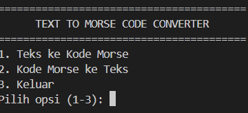

# Text to Morse Code Converter

## Deskripsi Proyek
Text to Morse Code Converter adalah skrip Python berbasis command-line (CLI) yang mengonversi teks biasa menjadi kode Morse, maupun sebaliknya dari kode Morse kembali menjadi teks. Proyek ini menyelesaikan masalah menerjemahkan pesan ke dalam kode Morse secara instan tanpa perlu menghafal atau mencari tabel referensi Morse secara manual.

## Tampilan Aplikasi

## Fitur Utama
- Konversi dua arah: teks ke kode Morse dan kode Morse ke teks
- Mendukung huruf A-Z, angka 0-9, serta tanda baca umum (titik, koma, tanda tanya, dan lainnya)
- Setiap huruf dipisahkan oleh spasi, dan setiap kata dipisahkan oleh tanda " / " sesuai konvensi standar penulisan kode Morse
- Input tidak case-sensitive, huruf kecil otomatis dikonversi ke huruf besar sebelum diproses
- Menu interaktif berbasis pilihan angka yang dapat digunakan berulang kali dalam satu sesi program

## Teknologi yang Digunakan
- Python 3.x

## Arsitektur
Alur kerja skrip ini berbasis menu pilihan yang berjalan dalam loop:
1. `MORSE_CODE_DICT` menyimpan pemetaan setiap karakter ke kode Morse-nya, sementara `MORSE_TO_TEXT_DICT` dibuat otomatis sebagai kebalikannya menggunakan dictionary comprehension.
2. `text_to_morse()` memecah teks menjadi kata, lalu setiap kata dipecah menjadi huruf dan diterjemahkan satu per satu ke kode Morse menggunakan `MORSE_CODE_DICT`, sebelum digabungkan kembali dengan pemisah spasi antar huruf dan " / " antar kata.
3. `morse_to_text()` melakukan proses kebalikannya: memecah input berdasarkan " / " untuk mendapatkan kata, lalu memecah setiap kata berdasarkan spasi untuk mendapatkan huruf, dan menerjemahkannya kembali menggunakan `MORSE_TO_TEXT_DICT`.
4. Program terus menampilkan menu dan memproses pilihan pengguna hingga opsi "Keluar" dipilih.

## Pembelajaran Spesifik
- Membuat dictionary kebalikan (`MORSE_TO_TEXT_DICT`) secara otomatis dari dictionary yang sudah ada menggunakan dictionary comprehension, menghindari duplikasi data yang harus dikelola secara manual di dua tempat berbeda.
- Memahami pentingnya pemisah berlapis (spasi untuk huruf, " / " untuk kata) saat bekerja dengan format data yang merepresentasikan struktur hierarkis (karakter di dalam kata, kata di dalam kalimat).
- Menerapkan `dict.get()` dengan nilai default saat proses dekode, agar karakter yang tidak dikenali tidak menyebabkan program error, melainkan diabaikan secara halus.
- Membiasakan normalisasi input (mengubah ke huruf besar) sebelum pemrosesan, memastikan proses pencarian pada dictionary tetap konsisten tanpa bergantung pada format input pengguna.