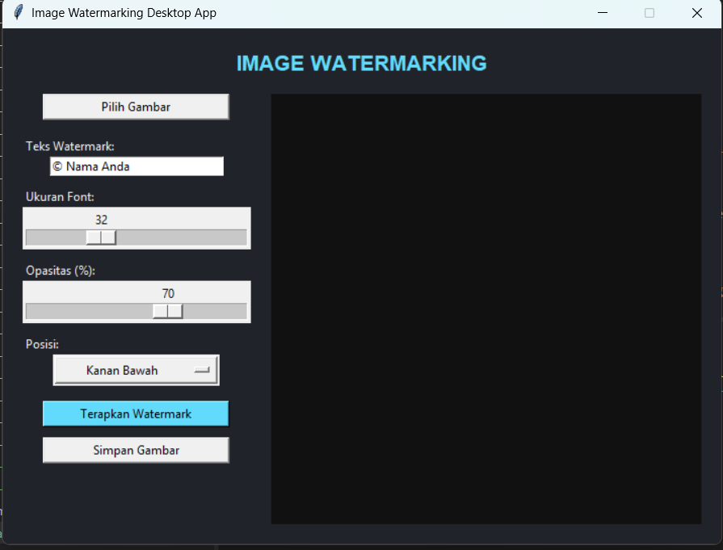

# Image Watermarking Desktop App

## Deskripsi Proyek
Image Watermarking Desktop App adalah aplikasi GUI untuk menambahkan watermark teks ke sebuah gambar, dibangun menggunakan Tkinter dan Pillow dengan pendekatan OOP (Object-Oriented Programming). Pengguna dapat memilih gambar, menentukan teks watermark, mengatur ukuran font, opasitas, dan posisi, lalu menyimpan hasilnya sebagai file gambar baru. Proyek ini menyelesaikan masalah melindungi kepemilikan gambar (misalnya hasil karya foto atau desain) dari penggunaan tanpa izin, tanpa perlu membuka aplikasi pengolah gambar yang lebih kompleks seperti Photoshop.

## Tampilan Aplikasi

## Fitur Utama
- Memilih gambar dari komputer melalui dialog pemilihan file, mendukung format PNG, JPG, JPEG, dan BMP
- Preview gambar ditampilkan langsung di dalam aplikasi, baik sebelum maupun sesudah watermark diterapkan
- Teks watermark dapat disesuaikan sepenuhnya oleh pengguna
- Pengaturan ukuran font dan opasitas watermark menggunakan slider interaktif
- Lima pilihan posisi watermark: Kanan Bawah, Kiri Bawah, Kanan Atas, Kiri Atas, dan Tengah
- Validasi otomatis apabila pengguna mencoba menerapkan watermark tanpa gambar atau tanpa teks
- Menyimpan hasil akhir ke lokasi dan nama file pilihan pengguna melalui dialog simpan file
- Struktur kode berbasis OOP yang memisahkan logika pemrosesan gambar (`WatermarkProcessor`) dari tampilan antarmuka (`WatermarkApp`)

## Teknologi yang Digunakan
- Python 3.x
- Tkinter
- Pillow

## Arsitektur
Proyek ini dirancang dengan dua class utama yang saling terhubung mengikuti prinsip OOP:
1. **`WatermarkProcessor`** menangani seluruh logika pemrosesan gambar menggunakan Pillow. Method `load_image()` memuat gambar dari file, `apply_watermark()` membuat layer transparan terpisah (`overlay`) berisi teks watermark dengan opasitas dan posisi yang ditentukan, lalu menggabungkannya dengan gambar asli menggunakan `Image.alpha_composite()`, dan `save()` menyimpan hasil akhir ke file tujuan.
2. **`WatermarkApp`** menjadi class utama yang membangun tampilan Tkinter (kontrol di sisi kiri, area preview di sisi kanan) dan menghubungkannya dengan `WatermarkProcessor`. Method `open_image()` menangani pemilihan file dan preview awal, `apply_watermark()` mengambil seluruh pengaturan dari slider dan input pengguna lalu memprosesnya, dan `save_image()` menangani penyimpanan hasil akhir.

Alur interaksinya: pengguna menekan "Pilih Gambar" → `WatermarkApp` memuat gambar lewat `WatermarkProcessor.load_image()` dan menampilkan preview → pengguna mengatur teks, ukuran font, opasitas, dan posisi, lalu menekan "Terapkan Watermark" → `WatermarkProcessor.apply_watermark()` memproses gambar dan hasilnya langsung ditampilkan di preview → pengguna menekan "Simpan Gambar" untuk menyimpan hasil akhir ke file.

## Pembelajaran Spesifik
- Menerapkan teknik watermarking menggunakan layer transparan terpisah (`overlay` dengan mode RGBA) yang digabungkan dengan gambar asli melalui `Image.alpha_composite()`, pendekatan yang memberi kontrol penuh terhadap opasitas watermark tanpa merusak gambar asli secara langsung.
- Menggunakan `ImageDraw.textbbox()` untuk menghitung dimensi teks secara presisi sebelum digambar, penting untuk memposisikan watermark dengan tepat di sudut-sudut gambar (misalnya memastikan teks tidak terpotong di tepi).
- Menangani kemungkinan font kustom tidak tersedia di sistem pengguna dengan `try-except`, dan otomatis beralih ke font default Pillow (`ImageFont.load_default()`) sebagai fallback agar aplikasi tidak crash.
- Menggunakan `ImageTk.PhotoImage` untuk menampilkan gambar Pillow di dalam widget Tkinter, serta menyimpan referensinya (`self.preview_label.image = tk_image`) untuk mencegah gambar hilang akibat garbage collection Python.
- Memisahkan logika pemrosesan gambar murni (`WatermarkProcessor`) dari logika antarmuka (`WatermarkApp`), sehingga proses watermarking dapat diuji dan digunakan kembali secara independen tanpa bergantung pada Tkinter.