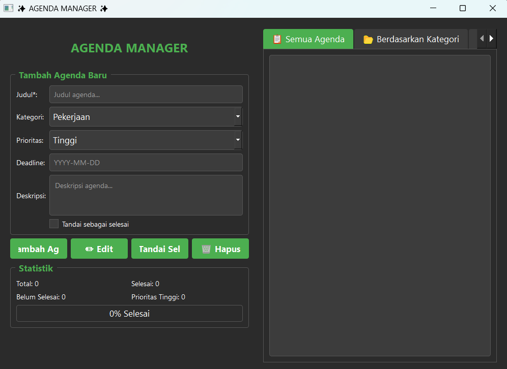

# Agenda Manager Pro

## Deskripsi Proyek
Agenda Manager Pro adalah aplikasi desktop untuk mengelola agenda atau daftar tugas harian, dibangun menggunakan PyQt5 dengan pola arsitektur Model-View-Controller (MVC). Pengguna dapat menambah, mengedit, menghapus, dan menandai agenda sebagai selesai, lengkap dengan kategori, tingkat prioritas, deadline, serta ringkasan statistik progres. Proyek ini menyelesaikan masalah mencatat dan memantau berbagai tugas dengan tingkat kepentingan berbeda dalam satu aplikasi terpusat, tanpa perlu mencatatnya secara manual di kertas atau aplikasi catatan biasa yang tidak terstruktur.

## Tampilan Aplikasi

## Fitur Utama
- Menambah agenda baru dengan judul, deskripsi, kategori, tingkat prioritas (Tinggi/Sedang/Rendah), dan deadline
- Mengedit agenda yang sudah ada, tombol aksi otomatis berubah menjadi mode "Update" saat agenda dipilih untuk diedit
- Menghapus agenda dengan dialog konfirmasi terlebih dahulu untuk mencegah penghapusan tidak sengaja
- Menandai agenda sebagai selesai dengan satu klik tombol
- Tiga tab tampilan berbeda: Semua Agenda, Berdasarkan Kategori (dengan filter dropdown), dan Prioritas Tinggi
- Setiap item agenda ditampilkan dengan ikon status (selesai/belum) dan ikon prioritas, serta cuplikan deskripsi dan deadline jika tersedia
- Panel statistik menampilkan total agenda, jumlah selesai, belum selesai, jumlah prioritas tinggi, beserta progress bar persentase penyelesaian
- Tema visual gelap (dark theme) kustom yang diterapkan secara global lewat stylesheet QSS
- Data agenda tersimpan otomatis ke file `data/data_agenda.json` setiap kali terjadi perubahan (tambah, edit, hapus, atau tandai selesai)
- Pencatatan log aktivitas aplikasi ke file `logs/app.log`, mempermudah penelusuran masalah jika terjadi error

## Teknologi yang Digunakan
- Python 3.x
- PyQt5
- Modul `json`, `logging`, `pathlib`, dan `datetime`

## Arsitektur
Proyek ini mengikuti pola Model-View-Controller (MVC), dengan tanggung jawab yang terbagi jelas ke dalam beberapa file:
1. **`model.py`** berisi dua komponen inti: class `AgendaItem` yang merepresentasikan satu entri agenda beserta method `to_dict()`/`from_dict()` untuk serialisasi, dan class `ModelAgenda` yang mengelola seluruh data agenda, termasuk memuat (`muat_data()`) dan menyimpan (`simpan_data()`) data ke file JSON, serta operasi CRUD (`tambah_agenda()`, `hapus_agenda()`, `update_agenda()`) dan pengambilan statistik (`dapatkan_statistik()`).
2. **`gui.py`** berisi class `MainWindow` yang membangun seluruh tampilan PyQt5: form input, tombol aksi, panel statistik, serta tiga tab daftar agenda menggunakan `QTabWidget`. Class ini juga menyediakan method bantuan seperti `dapatkan_input_agenda()` dan `tampilkan_pesan()` yang dipanggil oleh controller.
3. **`controller.py`** berisi class `ControllerAgenda` yang menjembatani `ModelAgenda` dan `MainWindow`. Method `setup_koneksi()` menghubungkan setiap tombol pada GUI ke method penanganan aksinya masing-masing (`proses_tambah_agenda()`, `proses_hapus_agenda()`, `proses_edit_agenda()`, `proses_tandai_selesai()`), sementara `tampilkan_agenda_di_list()` memformat dan menampilkan data dari model ke widget daftar pada GUI.
4. **`main.py`** menjadi entry point aplikasi: menyiapkan logging, membuat struktur folder (`data`, `logs`, `exports`), memuat stylesheet dari `styles.py`, lalu menginisialisasi dan menjalankan `ControllerAgenda`.
5. **`styles.py`** dan **`resource.py`** menyimpan konfigurasi tampilan terpisah dari logika aplikasi: `styles.py` berisi stylesheet QSS lengkap untuk tema gelap, sementara `resource.py` menyediakan konstanta ikon emoji dan palet warna yang disiapkan sebagai referensi terpusat.
6. **`database.py`** menyediakan class `DatabaseManager` berbasis SQLite sebagai lapisan penyimpanan alternatif (tabel `agenda` dan `riwayat`), disiapkan untuk pengembangan lebih lanjut meski alur utama aplikasi saat ini masih menggunakan penyimpanan JSON melalui `ModelAgenda`.

## Pembelajaran Spesifik
- Menerapkan pola arsitektur MVC secara konsisten pada aplikasi PyQt5, memisahkan data (`model.py`), tampilan (`gui.py`), dan logika penghubung (`controller.py`) sehingga setiap bagian dapat dikembangkan atau diuji secara independen.
- Menggunakan sistem sinyal-slot milik Qt (`clicked.connect()`, `currentTextChanged.connect()`) untuk menghubungkan interaksi pengguna pada GUI dengan method penanganan di controller, tanpa GUI perlu mengetahui detail logika bisnis.
- Memanfaatkan `QListWidgetItem.setData()` dengan custom role untuk menyimpan ID agenda yang tidak terlihat di layar namun dapat diambil kembali saat item dipilih, teknik umum untuk mengaitkan data asli dengan tampilan visualnya.
- Mengubah perilaku tombol secara dinamis saat runtime (`btn_tambah.disconnect()` lalu `connect()` ulang ke fungsi berbeda) untuk mendukung mode edit tanpa perlu tombol terpisah, sebuah pola yang perlu digunakan dengan hati-hati agar koneksi sinyal lama benar-benar terputus.
- Menerapkan stylesheet QSS terpisah dari kode logika (`styles.py`) agar tampilan aplikasi dapat diubah atau dikembangkan tanpa menyentuh kode fungsional, mirip prinsip pemisahan CSS dari HTML/JavaScript pada pengembangan web.