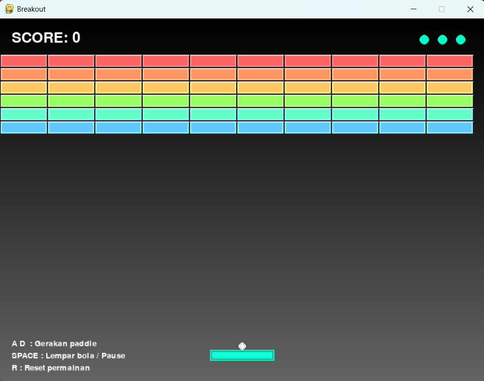

# Breakout

## Deskripsi Proyek
Breakout adalah replika permainan arcade klasik Breakout (pemecah balok), dibangun menggunakan Pygame dengan struktur kode yang terorganisir ke dalam beberapa modul terpisah (konfigurasi, entitas game, dan utilitas gambar). Pemain mengendalikan paddle untuk memantulkan bola dan menghancurkan seluruh brick di layar tanpa membiarkan bola jatuh ke bawah. Proyek ini menyelesaikan masalah mensimulasikan game arcade klasik secara lengkap, termasuk fisika pantulan dengan sudut dinamis, sistem nyawa, efek visual sederhana, serta kondisi menang dan kalah.

## Tampilan Aplikasi

## Fitur Utama
- Kendali paddle menggunakan tombol panah kiri/kanan atau A/D
- Bola menempel di paddle saat permainan dimulai atau nyawa berkurang, dilempar dengan menekan SPACE
- Sudut pantulan bola terhadap paddle berubah dinamis tergantung titik tumbukan, memberi kontrol lebih kepada pemain
- Enam baris brick dengan warna berbeda per baris, tersusun otomatis sesuai ukuran layar
- Sistem nyawa (3 nyawa) yang ditampilkan sebagai indikator bulat di pojok kanan atas
- Skor bertambah setiap kali brick berhasil dihancurkan
- Efek flash singkat saat brick terkena bola, serta efek glow sederhana pada paddle dan bola
- Background bergradasi warna yang digambar secara dinamis
- Fitur pause (SPACE) dan reset permainan (R) kapan saja
- Layar overlay khusus untuk kondisi Game Over dan Victory, lengkap dengan skor akhir
- Struktur kode modular: konfigurasi terpusat (`config.py`), entitas game terpisah per file (`paddle.py`, `ball.py`, `brick.py`), dan fungsi gambar reusable (`utils/draw.py`)

## Teknologi yang Digunakan
- Python 3.x
- Pygame

## Arsitektur
Proyek ini dipecah ke dalam beberapa modul dengan tanggung jawab yang jelas:
1. **`config.py`** menyimpan seluruh nilai konfigurasi terpusat: ukuran layar, FPS, palet warna, serta parameter ukuran dan kecepatan paddle, bola, dan brick. Memusatkan nilai-nilai ini memudahkan penyesuaian gameplay tanpa perlu menelusuri banyak file.
2. **`entities/paddle.py`** berisi class `Paddle` yang menangani pergerakan (`move_left()`, `move_right()`), pembatasan posisi agar tidak keluar layar (`update()`), dan penggambaran dengan efek glow sederhana.
3. **`entities/ball.py`** berisi class `Ball` yang menangani pergerakan, pemantulan arah (`bounce_x()`, `bounce_y()`), deteksi tabrakan dengan paddle (`collide_with_paddle()`), serta status "menempel" (`stuck`) saat bola belum dilempar.
4. **`entities/brick.py`** berisi class `Brick` untuk satu unit balok (termasuk sistem `health` agar mendukung brick yang butuh beberapa kali tabrakan), dan class `BrickManager` yang mengelola seluruh brick sekaligus: membuat susunan grid brick (`create_bricks()`), memeriksa tabrakan dengan bola (`check_collision()`), serta melacak sisa brick yang masih aktif.
5. **`utils/draw.py`** berisi fungsi-fungsi gambar reusable yang tidak terikat pada entitas tertentu, seperti `draw_text()` untuk teks dengan opsi perataan tengah, dan `draw_gradient_background()` untuk menggambar latar belakang bergradasi.
6. **`main.py`** berisi class `BreakoutGame` yang menjadi orkestrator utama: menginisialisasi seluruh entitas lewat `reset_game()`, menangani input (`handle_input()`), memperbarui logika permainan setiap frame (`update()`) termasuk seluruh deteksi tabrakan dan kondisi menang/kalah, menggambar seluruh elemen ke layar (`draw()`), dan menjalankan game loop utama (`run()`) yang mengatur event Pygame serta frame rate.

## Pembelajaran Spesifik
- Memahami cara kerja fisika pantulan dengan sudut dinamis, yaitu menghitung posisi relatif tumbukan bola terhadap paddle untuk menentukan seberapa besar kecepatan horizontal bola berubah, menciptakan kontrol yang lebih presisi dibanding pantulan sudut tetap.
- Menerapkan pemisahan modul berbasis tanggung jawab (konfigurasi, entitas, utilitas), sehingga setiap file memiliki fokus tunggal dan mudah ditelusuri saat ingin mengubah aspek tertentu dari game.
- Menggunakan sistem `health` pada class `Brick` sebagai fondasi yang dapat dikembangkan lebih lanjut untuk brick yang butuh beberapa kali tabrakan sebelum hancur, meski saat ini seluruh brick menggunakan nilai health default (1).
- Membedakan penanganan input berbasis state berkelanjutan (`pygame.key.get_pressed()` untuk gerakan paddle) dengan input berbasis event sesaat (`pygame.KEYDOWN` untuk SPACE), penting karena keduanya memerlukan pendekatan berbeda tergantung jenis aksi yang diinginkan.
- Mengelola berbagai state permainan (`paused`, `game_over`, `victory`) sebagai flag boolean terpisah yang saling memengaruhi alur `update()` dan `draw()`, pendekatan sederhana namun efektif untuk game dengan jumlah state yang tidak terlalu kompleks.