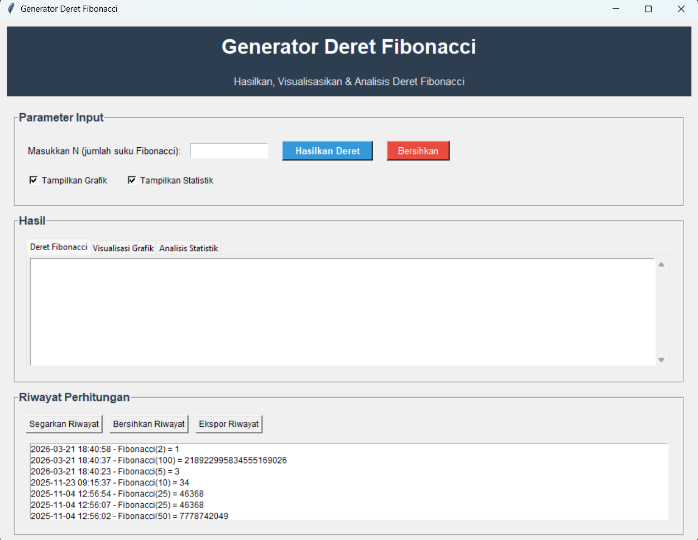

# Generator Deret Fibonacci

## Deskripsi Proyek
Generator Deret Fibonacci adalah aplikasi desktop berbasis Tkinter untuk menghasilkan, memvisualisasikan, dan menganalisis deret Fibonacci. Pengguna memasukkan jumlah suku yang ingin dihitung, kemudian aplikasi menampilkan deret, grafik nilai dan rasio suku berurutan, serta statistik seperti total, rata-rata, suku genap dan ganjil, dan pendekatan terhadap golden ratio. Hasil perhitungan tersimpan dalam riwayat lokal berbasis JSON, yang dapat dimuat kembali atau diekspor ke file teks.

## Tampilan Aplikasi

## Fitur Utama
- Membuat deret Fibonacci berdasarkan jumlah suku yang dimasukkan pengguna
- Validasi input agar jumlah suku berupa bilangan bulat positif
- Konfirmasi sebelum menghitung deret yang berjumlah lebih dari 1.000 suku
- Menampilkan hasil deret dengan indeks setiap suku (`F(0)`, `F(1)`, dan seterusnya), serta bentuk deret ringkas
- Visualisasi grafik nilai deret dan rasio antar suku secara berdampingan
- Menampilkan statistik: jumlah, total, rata-rata, nilai terbesar dan terkecil, serta jumlah suku genap dan ganjil
- Menganalisis rasio dua suku terakhir dan selisihnya terhadap golden ratio
- Opsi untuk mengaktifkan atau menonaktifkan tampilan grafik dan statistik
- Menyimpan riwayat perhitungan secara otomatis ke `fibonacci_history.json`
- Menampilkan hingga 20 perhitungan terbaru dan memuat ulang perhitungan dengan klik ganda pada riwayat
- Menghapus riwayat dengan konfirmasi dan mengekspornya ke file teks bertimestamp
- Membersihkan input dan hasil tampilan tanpa menghapus riwayat
- Menampilkan status proses melalui status bar di bagian bawah jendela

## Teknologi yang Digunakan
- Python 3.x
- Tkinter dan `ttk` untuk antarmuka desktop
- Matplotlib untuk visualisasi grafik
- Modul standar `json`, `os`, `datetime`, dan `typing`

## Arsitektur
Proyek ini memisahkan antarmuka, perhitungan, dan pengelolaan riwayat ke dalam beberapa modul:
1. **`src/main.py`** menjadi titik masuk aplikasi. Modul ini membuat root window Tkinter, menginisialisasi `AntarmukaFibonacci`, lalu menjalankan event loop.
2. **`src/gui.py`** berisi class `AntarmukaFibonacci` yang membangun antarmuka, menghubungkan input dan tombol ke proses perhitungan, memperbarui tab hasil dan daftar riwayat, serta mengatur dialog konfirmasi dan ekspor.
3. **`src/fibonacci_calculator.py`** berisi class `FibonacciCalculator` dengan method untuk menghitung deret, menghitung statistik, dan memformat suku-suku deret.
4. **`src/history_manager.py`** berisi class `ManajerRiwayat` yang memuat, menyimpan, menambah, membersihkan, dan mengekspor riwayat perhitungan.
5. **`fibonacci_history.json`** menyimpan riwayat perhitungan lokal dalam format JSON. File ini dibuat atau diperbarui ketika aplikasi menambahkan atau menghapus riwayat.
6. **`tampilan/image.png`** berisi tangkapan layar antarmuka aplikasi.

## Pembelajaran Spesifik
- Memisahkan logika perhitungan dari antarmuka agar kalkulator dapat dikembangkan dan diuji tanpa bergantung pada widget GUI.
- Menggunakan `FigureCanvasTkAgg` untuk menanamkan grafik Matplotlib langsung ke tab Tkinter.
- Menghitung statistik dan rasio suku berurutan untuk menghubungkan deret Fibonacci dengan golden ratio.
- Menyimpan objek riwayat ke JSON agar data perhitungan tetap tersedia setelah aplikasi ditutup.
- Memperbarui daftar dengan urutan terbaru di bagian atas, sambil mengonversi indeks tampilan ketika pengguna memilih entri untuk dimuat kembali.
- Menggunakan checkbox untuk memberi kontrol kepada pengguna atas pembuatan grafik dan analisis statistik.