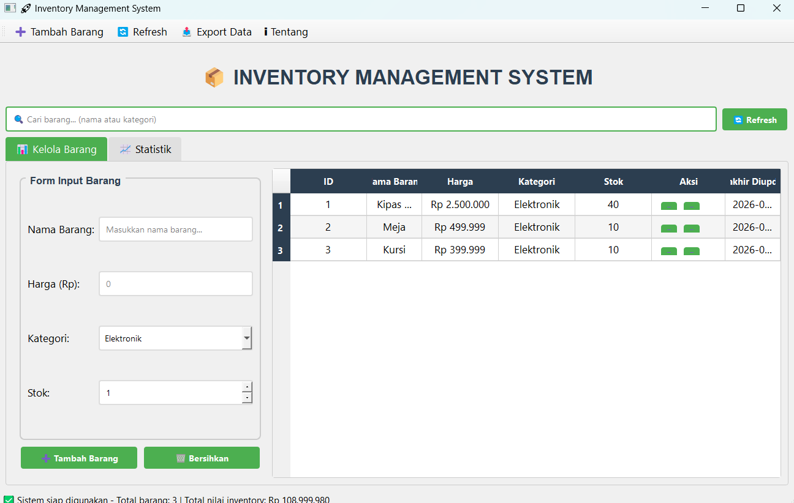

# Inventory Management System

## Deskripsi Proyek
Inventory Management System adalah aplikasi desktop untuk mengelola data barang dan stok inventory, dibangun menggunakan PyQt5 dengan struktur kode modular (handler database, model data, dan widget terpisah per komponen). Pengguna dapat menambah, mengedit, menghapus barang, mengelola stok masuk/keluar, memantau statistik inventory secara visual, serta mengekspor data ke beberapa format file. Proyek ini menyelesaikan masalah mencatat dan memantau persediaan barang secara manual yang rawan kesalahan, dengan menyediakan satu aplikasi terpusat yang mencatat setiap perubahan stok sebagai riwayat transaksi.

## Tampilan Aplikasi

## Fitur Utama
- Manajemen barang lengkap (CRUD): tambah, edit, dan hapus data barang beserta nama, harga, kategori, dan stok awal
- Manajemen stok terpisah dari edit data barang, dengan dialog khusus untuk menambah atau mengurangi stok beserta keterangan
- Validasi otomatis saat mengurangi stok melebihi jumlah yang tersedia
- Pencarian real-time berdasarkan nama atau kategori barang
- Highlight warna otomatis pada tabel untuk stok rendah (kuning) dan stok habis (merah)
- Menu klik kanan (context menu) pada tabel untuk akses cepat ke aksi edit, tambah stok, kurangi stok, dan hapus
- Tab Statistik dengan kartu ringkasan (total barang, total stok, total nilai inventory), rincian per kategori, peringatan stok rendah/habis, info harga tertinggi dan terendah, serta riwayat transaksi terbaru
- Setiap perubahan stok otomatis tercatat sebagai transaksi (jenis masuk/keluar, jumlah, keterangan, dan waktu)
- Export data barang ke tiga format: CSV, JSON, dan Excel (format Excel memerlukan library `pandas` dan `openpyxl`)
- Status bar yang menampilkan total barang dan total nilai inventory secara real-time
- Antarmuka modern menggunakan gaya `Fusion` PyQt5 dengan palet warna dan stylesheet kustom

## Teknologi yang Digunakan
- Python 3.x
- PyQt5
- pandas dan openpyxl (opsional, hanya dibutuhkan untuk fitur export ke Excel)

## Arsitektur
Proyek ini disusun dengan pemisahan tanggung jawab yang jelas antar file:
1. **`barang.py`** berisi `Barang`, sebuah dataclass yang merepresentasikan satu entri barang beserta method `to_dict()`/`from_dict()` untuk konversi ke dan dari format dictionary, mempermudah proses serialisasi ke JSON.
2. **`db_handler.py`** berisi class `DatabaseHandler` yang menjadi satu-satunya titik akses ke data, menyimpan seluruh barang dan riwayat transaksi dalam `data/data_inventory.json`. Class ini menangani operasi CRUD barang, `tambah_stok()`/`kurangi_stok()` yang otomatis mencatat transaksi lewat `_add_transaction()`, serta `get_statistik()` yang menghitung berbagai agregasi data (total nilai, stok rendah/habis, harga tertinggi/terendah, statistik per kategori) untuk ditampilkan di tab Statistik.
3. **`widgets/form_widget.py`** berisi `FormInputBarang` (form tambah/edit barang yang berganti mode secara dinamis) dan `StockManagementDialog` (dialog terpisah khusus untuk operasi tambah/kurangi stok dengan peringatan visual saat stok tidak mencukupi).
4. **`widgets/table_widget.py`** berisi `CustomTableWidget`, tabel kustom yang menampilkan seluruh barang dengan pewarnaan baris otomatis berdasarkan level stok, tombol aksi cepat per baris, serta context menu klik kanan. Komponen ini berkomunikasi dengan jendela utama murni lewat PyQt signal (`itemDeleted`, `itemEdited`, `stockAdded`, `stockReduced`), tanpa mengakses database secara langsung.
5. **`widgets/statistics_widget.py`** berisi `StatisticsWidget` yang menampilkan seluruh data statistik dari `DatabaseHandler.get_statistik()` dalam bentuk kartu ringkasan, tabel per kategori, dan tabel riwayat transaksi, dengan method `refresh()` yang dipanggil setiap kali data berubah.
6. **`utils/export_utils.py`** berisi `ExportUtils`, class yang menangani ekspor data ke CSV, JSON, dan Excel, masing-masing dengan dialog simpan file dan sinyal `exportFinished` untuk melaporkan hasil (berhasil/gagal) kembali ke jendela utama.
7. **`styles.py`** memisahkan konfigurasi visual (font, palet warna, stylesheet QSS lengkap) dari logika aplikasi.
8. **`main.py`** berisi `MainWindow` sebagai orkestrator utama yang merakit seluruh widget di atas ke dalam satu tampilan (search bar, dua tab utama, toolbar, status bar), menghubungkan setiap sinyal widget ke method penanganannya masing-masing, dan menjadi satu-satunya tempat yang memanggil `DatabaseHandler` untuk operasi data.

## Pembelajaran Spesifik
- Menerapkan komunikasi antar widget murni melalui PyQt signal-slot (`pyqtSignal`), sehingga widget seperti `CustomTableWidget` tidak perlu mengetahui apa pun tentang `DatabaseHandler` — ia hanya memancarkan sinyal, dan `MainWindow` yang memutuskan apa yang harus dilakukan.
- Memisahkan operasi "mengubah data barang" dari "mengubah stok" menjadi dua alur berbeda (form edit vs dialog manajemen stok), mencerminkan kebutuhan nyata sistem inventory di mana perubahan stok perlu tercatat sebagai riwayat transaksi, bukan sekadar nilai yang ditimpa.
- Menggunakan Python dataclass (`@dataclass`) untuk merepresentasikan entitas data (`Barang`) dengan kode yang jauh lebih ringkas dibanding class biasa, sambil tetap bisa menambahkan method kustom seperti `to_dict()`.
- Menerapkan penanganan dependensi opsional dengan `try-except ImportError` pada fitur export Excel, sehingga aplikasi tetap berjalan normal meskipun `pandas`/`openpyxl` belum terinstal, dan hanya fitur yang terkait yang memberi pesan error informatif.
- Memvisualisasikan status data secara langsung lewat warna (baris tabel merah/kuning untuk stok kritis), teknik sederhana namun efektif untuk membantu pengguna menangkap informasi penting tanpa perlu membaca angka satu per satu.