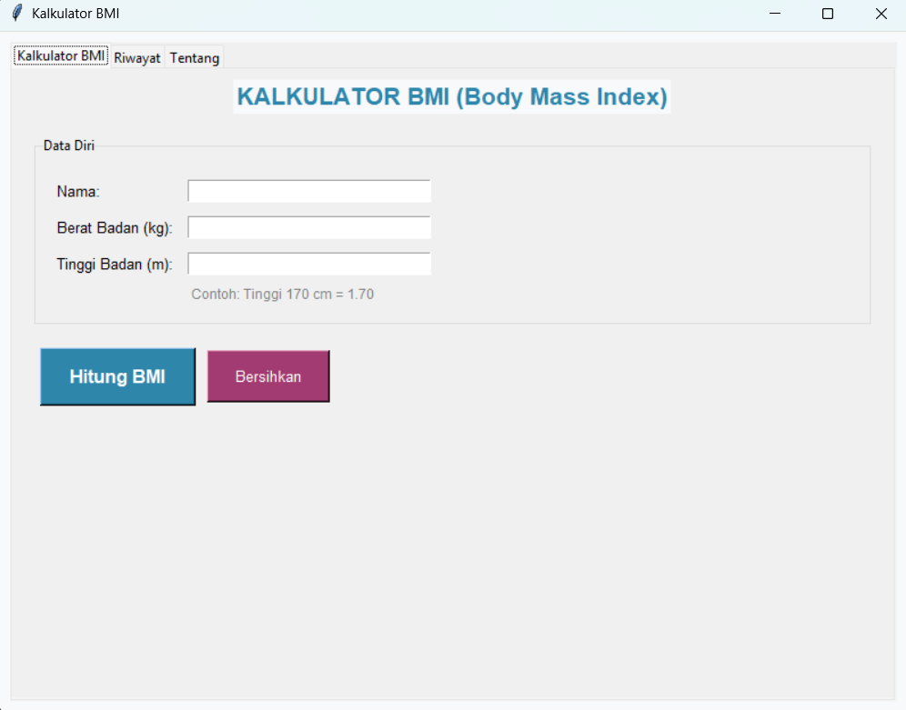

# BMI Calculator

## Deskripsi Proyek
BMI Calculator adalah aplikasi desktop untuk menghitung Body Mass Index (BMI/Indeks Massa Tubuh), dibangun menggunakan Tkinter dengan struktur kode modular (logika perhitungan, pengelolaan riwayat, dan konfigurasi tampilan dipisah per file). Pengguna cukup memasukkan berat dan tinggi badan untuk mendapatkan nilai BMI, kategori berat badan, rentang berat ideal, serta rekomendasi kesehatan yang sesuai. Proyek ini menyelesaikan masalah memantau indikator kesehatan dasar secara cepat tanpa perlu menghitung manual atau mencari kalkulator BMI online, sekaligus menyimpan riwayat perhitungan agar progres dapat dipantau dari waktu ke waktu.

## Tampilan Aplikasi

## Fitur Utama
- Perhitungan BMI otomatis berdasarkan berat badan (kg) dan tinggi badan (m)
- Klasifikasi otomatis ke dalam empat kategori: Kekurangan berat badan, Normal, Kelebihan berat badan, dan Obesitas
- Perhitungan rentang berat badan ideal berdasarkan tinggi badan yang dimasukkan
- Rekomendasi kesehatan yang berbeda untuk setiap kategori BMI
- Warna hasil yang berubah otomatis sesuai kategori, memberi umpan balik visual langsung
- Validasi input, menolak nilai berat/tinggi nol, negatif, atau bukan angka
- Tab Riwayat yang menampilkan 20 perhitungan terakhir beserta waktu, nama, berat, tinggi, BMI, dan kategorinya
- Opsi menghapus seluruh riwayat dengan dialog konfirmasi terlebih dahulu
- Tab Tentang yang menjelaskan cara penggunaan aplikasi dan rentang kategori BMI
- Data riwayat tersimpan otomatis ke file `data/history.json`, sehingga tetap ada meskipun aplikasi ditutup dan dibuka kembali
- Antarmuka berbasis tab (`ttk.Notebook`) yang memisahkan Kalkulator, Riwayat, dan Tentang ke dalam tiga tampilan terpisah
- Struktur kode modular yang memisahkan logika perhitungan (`BMICalculator`), pengelolaan riwayat (`HistoryManager`), dan tampilan (`BMIApp`)

## Teknologi yang Digunakan
- Python 3.x
- Tkinter beserta modul `ttk` dan `scrolledtext`
- Modul `json`, `os`, dan `datetime`

## Arsitektur
Proyek ini disusun dengan pemisahan tanggung jawab antar file:
1. **`bmi_calculator.py`** berisi class `BMICalculator` yang menjadi inti logika perhitungan murni, tanpa bergantung pada antarmuka apa pun. Method `calculate_bmi()` menghitung nilai BMI dari berat dan tinggi, `get_kategori()` memetakan nilai BMI ke salah satu dari empat kategori standar, dan `get_berat_ideal_range()` menghitung rentang berat ideal dengan merumuskan ulang formula BMI terhadap batas kategori normal (18.5 dan 25).
2. **`history_manager.py`** berisi class `HistoryManager` yang menangani seluruh penyimpanan riwayat ke file `data/history.json`. Method `save_record()` menambahkan satu entri baru beserta timestamp, `load_all_records()` membaca seluruh riwayat dengan penanganan error jika file belum ada atau rusak, `get_recent_records()` mengambil sejumlah entri terakhir, dan `clear_history()` menghapus seluruh file riwayat.
3. **`styles.py`** memisahkan konfigurasi visual dari logika aplikasi: `COLORS` untuk palet warna umum, `CATEGORY_COLORS` untuk warna spesifik per kategori BMI, dan `FONTS` untuk definisi font yang dipakai berulang di seluruh antarmuka.
4. **`main.py`** berisi class `BMIApp` yang merakit seluruh komponen menjadi satu aplikasi utuh. Method `setup_calculator_tab()`, `setup_history_tab()`, dan `setup_about_tab()` membangun masing-masing tab, `calculate_bmi()` mengambil input, memvalidasinya, memanggil `BMICalculator` dan `HistoryManager`, lalu menampilkan hasilnya lewat `show_results()`, termasuk rekomendasi kesehatan yang diambil dari `get_recommendation()` berdasarkan kategori BMI yang didapat.

## Pembelajaran Spesifik
- Memisahkan logika perhitungan murni (`BMICalculator`) sepenuhnya dari kode antarmuka, sehingga rumus BMI dan aturan kategorisasinya dapat diuji atau digunakan kembali tanpa bergantung pada Tkinter sama sekali.
- Menerapkan `ttk.Notebook` untuk membangun antarmuka bertab, pendekatan yang membantu mengorganisir banyak fitur (kalkulator, riwayat, tentang) ke dalam satu jendela tanpa membuat tampilan penuh sesak.
- Menghitung rentang nilai dari sebuah rumus dengan merumuskan ulang persamaan asalnya (BMI = berat / tinggi²) menjadi berat = BMI × tinggi², teknik aljabar sederhana namun berguna untuk menyajikan informasi dari sudut pandang berbeda.
- Menampilkan dan menyembunyikan frame secara dinamis (`pack()` dan `pack_forget()`) sebagai cara mengatur visibilitas panel hasil, hanya muncul setelah pengguna benar-benar melakukan perhitungan.
- Menggunakan dictionary sebagai basis pemetaan kategori ke rekomendasi teks dan warna (`CATEGORY_COLORS`, dictionary rekomendasi di `get_recommendation()`), menghindari percabangan if-elif yang panjang dan membuat konten lebih mudah diperluas di kemudian hari.