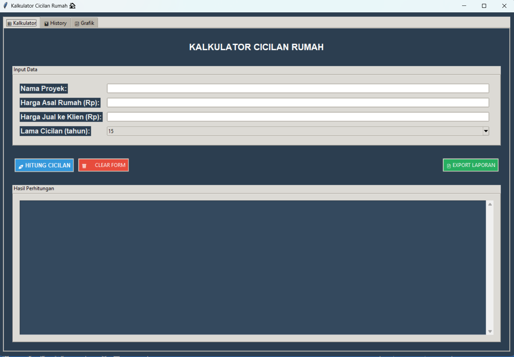

# Mortgage Payment Calculator

## Deskripsi Proyek
Mortgage Payment Calculator adalah aplikasi desktop untuk menghitung skema cicilan penjualan rumah beserta keuntungannya, dibangun menggunakan Tkinter dengan struktur kode modular (antarmuka, database, dan pembuat laporan dipisah per file). Pengguna memasukkan nama proyek, harga asal rumah, harga jual ke klien, dan lama cicilan, lalu aplikasi menghitung cicilan per tahun, cicilan per bulan, total keuntungan, serta persentase keuntungannya. Proyek ini menyelesaikan masalah menghitung dan membandingkan skema penjualan beberapa proyek rumah secara manual, dengan menyediakan satu aplikasi yang menyimpan setiap perhitungan sebagai riwayat, memvisualisasikannya dalam grafik, dan mengekspornya menjadi laporan PDF.

## Tampilan Aplikasi

## Fitur Utama
- Perhitungan otomatis cicilan per tahun, cicilan per bulan, total keuntungan, dan persentase keuntungan dari harga asal, harga jual, dan lama cicilan
- Pilihan lama cicilan melalui dropdown, dengan nilai awal 15 tahun
- Validasi input: nama proyek wajib diisi, harga harus lebih dari 0, harga jual tidak boleh lebih kecil dari harga asal, dan format angka harus valid
- Hasil perhitungan ditampilkan dalam bentuk ringkasan teks lengkap beserta analisis singkat di panel hasil
- Setiap perhitungan tersimpan otomatis ke database SQLite lokal, sehingga riwayat tetap ada meskipun aplikasi ditutup
- Tab History menampilkan tabel riwayat perhitungan (ID, tanggal, proyek, harga asal, harga jual, lama cicilan, cicilan per tahun, keuntungan) lengkap dengan scrollbar
- Tombol refresh riwayat dan tombol hapus seluruh riwayat yang dilengkapi dialog konfirmasi
- Tab Grafik menampilkan dua visualisasi dari 10 perhitungan terakhir: perbandingan harga asal dan harga jual per proyek, serta keuntungan per proyek, dilengkapi label nilai di atas setiap batang
- Export laporan ke file PDF yang berisi ringkasan (total proyek, total nilai proyek, total keuntungan, rata-rata keuntungan) dan tabel seluruh riwayat perhitungan
- Format mata uang Rupiah (Rp) dengan pemisah ribuan titik pada seluruh tampilan dan laporan
- Antarmuka berbasis tab (`ttk.Notebook`) yang memisahkan Kalkulator, History, dan Grafik ke dalam tiga tampilan terpisah

## Teknologi yang Digunakan
- Python 3.x
- Tkinter beserta modul `ttk`, `messagebox`, dan `scrolledtext`
- SQLite (modul `sqlite3`)
- Matplotlib
- FPDF (library `fpdf`)
- Modul `json`, `os`, `sys`, `locale`, dan `datetime`

## Arsitektur
Proyek ini disusun dengan pemisahan tanggung jawab antar file:
1. **`database.py`** berisi class `DatabaseManager` yang menangani seluruh akses ke database SQLite (`history/history_cicilan.db`). Method `_create_database()` membuat tabel `perhitungan_cicilan` jika belum ada, `simpan_perhitungan()` menyimpan satu hasil perhitungan (data tambahan seperti cicilan per bulan dan persentase keuntungan disimpan sebagai JSON pada kolom `metadata`), `ambil_history()` membaca riwayat dengan urutan terbaru di atas, serta `hapus_history()` dan `hapus_semua_history()` untuk penghapusan data.
2. **`gui.py`** berisi class `CicilanRumahApp` yang membangun seluruh antarmuka dengan tiga tab: `setup_kalkulator_tab()`, `setup_history_tab()`, dan `setup_grafik_tab()`. Method `hitung_cicilan()` mengambil input, memvalidasinya, menghitung hasil, menyimpannya lewat `DatabaseManager`, lalu menampilkannya lewat `tampilkan_hasil()`. Method `generate_grafik()` membuat figure Matplotlib berisi dua grafik batang dan menyematkannya ke dalam Tkinter lewat `FigureCanvasTkAgg`.
3. **`report_generator.py`** berisi class `ReportGenerator` yang menerima `DatabaseManager`, lalu `generate_pdf_report()` membuat file PDF menggunakan FPDF: judul, tanggal pembuatan, ringkasan statistik, tabel riwayat, dan footer, kemudian menyimpannya di folder `history/` dengan nama berformat timestamp.
4. **`main.py`** menjadi entry point aplikasi: menambahkan folder modul ke `sys.path`, membuat instance `CicilanRumahApp`, lalu menjalankannya dengan penanganan error agar pesan kesalahan tetap terbaca di terminal.

## Pembelajaran Spesifik
- Menyimpan data tambahan yang strukturnya fleksibel (cicilan per bulan dan persentase keuntungan) sebagai JSON dalam satu kolom `metadata`, sehingga skema tabel tidak perlu diubah setiap kali ada informasi baru yang ingin dicatat.
- Menyematkan grafik Matplotlib ke dalam jendela Tkinter menggunakan `FigureCanvasTkAgg`, sekaligus mengatur backend `TkAgg` agar grafik dapat dirender di dalam widget, bukan di jendela terpisah.
- Menggunakan SQLite sebagai penyimpanan lokal yang tidak memerlukan server database, cukup dengan modul `sqlite3` bawaan Python, dan memastikan folder penyimpanan dibuat otomatis dengan `os.makedirs(..., exist_ok=True)`.
- Menghasilkan laporan PDF secara terprogram dengan FPDF, termasuk menyusun tabel dari data database dengan lebar kolom tetap, serta memotong teks nama proyek yang terlalu panjang agar tidak merusak tata letak tabel.
- Memformat angka menjadi mata uang Rupiah dengan f-string (`:,.0f`) lalu mengganti pemisah koma menjadi titik, solusi sederhana yang tidak bergantung pada pengaturan locale sistem pengguna.