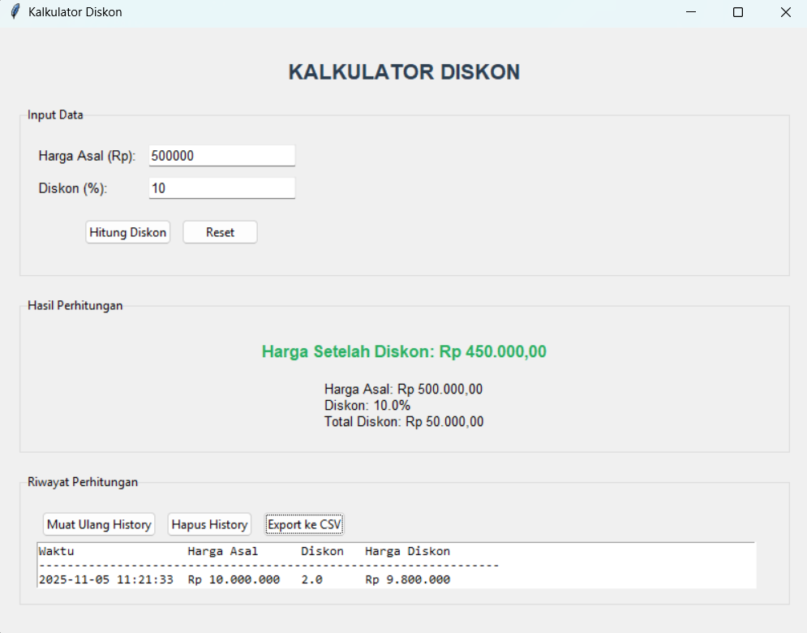

# Discount CAlculator

## Deskripsi Proyek
Discount CAlculator adalah aplikasi desktop untuk menghitung harga setelah diskon, dibangun menggunakan Tkinter dengan struktur kode modular (logika perhitungan, pengelolaan riwayat, dan antarmuka dipisah per file). Pengguna memasukkan harga asal dan persentase diskon, lalu aplikasi menampilkan harga akhir beserta total potongan harganya. Proyek ini menyelesaikan masalah menghitung potongan harga secara manual yang rawan salah hitung, sekaligus menyimpan riwayat perhitungan agar dapat ditinjau kembali atau diekspor ke file CSV.

## Tampilan Aplikasi

## Fitur Utama
- Perhitungan otomatis harga setelah diskon dari harga asal dan persentase diskon
- Hasil ditampilkan lengkap: harga setelah diskon, harga asal, persentase diskon, dan total potongan harga
- Format mata uang Rupiah dengan pemisah ribuan titik dan pemisah desimal koma
- Validasi input yang terpisah untuk harga dan diskon: tidak boleh kosong, harus berupa angka, harga harus lebih dari 0, dan diskon harus berada di rentang 0 sampai 100 persen
- Fokus kursor otomatis kembali ke kolom yang bermasalah saat validasi gagal
- Pintasan keyboard: tombol Enter berpindah dari kolom harga ke kolom diskon, lalu menghitung hasil dari kolom diskon
- Tombol Reset untuk mengosongkan input dan hasil dengan satu klik
- Riwayat perhitungan tersimpan otomatis ke file `history_diskon.json`, dan 10 perhitungan terakhir ditampilkan dalam bentuk tabel teks
- Tombol muat ulang riwayat, hapus riwayat (dengan dialog konfirmasi), dan export riwayat ke file `history_diskon.csv`

## Teknologi yang Digunakan
- Python 3.x
- Tkinter beserta modul `ttk`, `messagebox`, dan `scrolledtext`
- Modul `json`, `csv`, `os`, dan `datetime`

## Arsitektur
Proyek ini disusun dengan pemisahan tanggung jawab antar file:
1. **`diskon_core.py`** berisi class `DiskonCalculator` dengan seluruh method berupa `@staticmethod`, karena logikanya tidak memerlukan state. Method `hitung_diskon()` menghitung harga setelah diskon dan melempar `ValueError` jika diskon di luar rentang 0 sampai 100 atau harga negatif, sementara `validasi_input_harga()` dan `validasi_input_diskon()` memeriksa input berupa teks dan mengembalikan pasangan (status valid, nilai atau pesan error).
2. **`history_manager.py`** berisi class `HistoryManager` yang menangani penyimpanan riwayat ke `history_diskon.json`. Method `load_history()` memuat data dengan penanganan error jika file rusak, `tambah_history()` menambahkan satu entri beserta timestamp, `get_history()` mengambil data riwayat, `hapus_history()` mengosongkan riwayat, dan `export_to_csv()` menulis seluruh riwayat ke file CSV.
3. **`gui.py`** berisi class `AplikasiDiskon` yang membangun antarmuka dari tiga bagian: Input Data, Hasil Perhitungan, dan Riwayat Perhitungan. Method `hitung_diskon()` mengambil input, memvalidasinya lewat `DiskonCalculator`, menghitung hasil, menampilkannya lewat `tampilkan_hasil()`, lalu menyimpannya ke riwayat.
4. **`main.py`** menjadi entry point yang membuat jendela Tkinter dan menjalankan `AplikasiDiskon` dengan penanganan error agar pesan kesalahan tetap terbaca di terminal.

## Pembelajaran Spesifik
- Menggunakan `@staticmethod` untuk class yang hanya berisi fungsi murni tanpa state, sehingga logika perhitungan dapat dipanggil langsung lewat nama class tanpa perlu membuat objek.
- Memisahkan validasi input teks (`validasi_input_*`) dari perhitungan itu sendiri (`hitung_diskon`), sehingga validasi di antarmuka memberi pesan yang ramah pengguna, sementara perhitungan tetap memiliki pengaman sendiri berupa `ValueError`.
- Mengembalikan pasangan nilai (status, hasil atau pesan) dari fungsi validasi, pola sederhana yang memungkinkan pemanggil langsung memutuskan apakah akan melanjutkan proses atau menampilkan pesan error.
- Memformat angka ke format Rupiah Indonesia dengan menukar pemisah menggunakan penanda sementara (`replace(',', 'X')`, lalu titik menjadi koma, lalu `X` menjadi titik), karena penukaran dua karakter yang saling berlawanan tidak bisa dilakukan dengan satu langkah `replace` biasa.
- Menyimpan riwayat dalam format JSON yang mudah dibaca, dan menyediakan ekspor ke CSV sebagai format tambahan agar data dapat dibuka langsung di aplikasi spreadsheet.