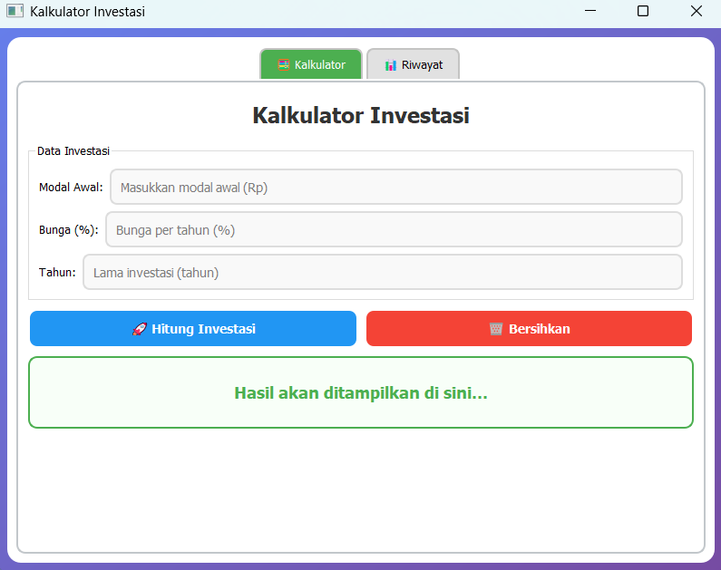

# Investment Calculator

## Deskripsi Proyek
Investment Calculator adalah aplikasi desktop untuk menghitung proyeksi nilai investasi dengan bunga majemuk, dibangun menggunakan PyQt5 dengan struktur kode modular (model data, penyimpanan, komponen tampilan, dan stylesheet dipisah per file). Pengguna memasukkan modal awal, persentase bunga per tahun, dan lama investasi dalam tahun, lalu aplikasi menampilkan nilai akhir investasi tersebut. Proyek ini menyelesaikan masalah memperkirakan pertumbuhan uang dari waktu ke waktu tanpa menghitung rumus bunga majemuk secara manual, sekaligus menyimpan riwayat perhitungan untuk dibandingkan antar skenario.

## Tampilan Aplikasi

## Fitur Utama
- Perhitungan nilai akhir investasi berdasarkan rumus bunga majemuk dari modal awal, bunga per tahun, dan jumlah tahun
- Hasil ditampilkan dengan format mata uang Rupiah dan pemisah ribuan
- Validasi input: seluruh nilai harus berupa angka yang valid dan lebih dari nol, dengan pesan peringatan jika tidak terpenuhi
- Kolom modal awal menerima angka dengan pemisah koma, yang dibersihkan otomatis sebelum dihitung
- Tombol Bersihkan untuk mengosongkan seluruh input dan hasil
- Tab Riwayat menampilkan tabel seluruh perhitungan sebelumnya, diurutkan dari yang terbaru
- Hapus seluruh riwayat dengan dialog konfirmasi terlebih dahulu
- Riwayat tersimpan otomatis ke file `history_investasi.json`, sehingga tetap ada meskipun aplikasi ditutup
- Tampilan modern dengan latar gradasi, kartu putih bersudut membulat, dan tab di bagian tengah, diatur lewat stylesheet QSS

## Teknologi yang Digunakan
- Python 3.x
- PyQt5
- Modul `json`, `os`, `dataclasses`, `datetime`, dan `typing`

## Arsitektur
Proyek ini disusun dengan pemisahan tanggung jawab antar file:
1. **`models.py`** berisi `Investasi`, sebuah dataclass yang merepresentasikan satu perhitungan (modal awal, bunga, tahun, hasil, dan tanggal yang otomatis terisi waktu saat ini lewat `__post_init__`), serta class `HistoryManager` yang menyimpan daftar investasi di memori dan mengembalikannya dalam urutan terbaru di atas.
2. **`database.py`** berisi class `DatabaseManager` yang menjadi lapisan penyimpanan ke `history_investasi.json`. Method `load_data()` membaca file JSON dan menyusun kembali objek `Investasi`, `save_investasi()` menambahkan satu entri lalu menyimpan ulang seluruh data lewat `save_data()`, dan `clear_history()` mengosongkan riwayat sekaligus menghapus file.
3. **`widgets.py`** berisi tiga komponen tampilan: `InputInvestasiWidget` untuk form dan hasil perhitungan (method `hitung_investasi()` menerapkan rumus `A = P × (1 + r)^t`), `HistoryWidget` untuk tabel riwayat dan tombol hapus, serta `MainTabWidget` yang menggabungkan keduanya ke dalam dua tab.
4. **`styles.py`** menyimpan seluruh stylesheet QSS sebagai satu konstanta `STYLESHEET`, memisahkan tampilan dari logika.
5. **`main.py`** berisi `InvestasiApp` sebagai jendela utama yang membuat `DatabaseManager`, menerapkan stylesheet, dan menampilkan `MainTabWidget`, lalu menjalankan aplikasi PyQt.

## Pembelajaran Spesifik
- Menerapkan rumus bunga majemuk `A = P × (1 + r)^t` dalam kode, termasuk mengonversi bunga dari persen menjadi desimal sebelum dihitung.
- Menggunakan `@dataclass` beserta `__post_init__` untuk menyiapkan nilai default yang dihitung saat objek dibuat (tanggal otomatis terisi), sesuatu yang tidak bisa dilakukan langsung lewat nilai default biasa pada dataclass.
- Memisahkan penyimpanan di memori (`HistoryManager`) dari penyimpanan permanen ke file (`DatabaseManager`), sehingga logika pengurutan dan pengelolaan daftar tidak tercampur dengan urusan baca-tulis file.
- Menyimpan tanggal dalam format ISO (`isoformat()`) dan membacanya kembali dengan `datetime.fromisoformat()`, cara yang andal untuk membawa objek tanggal bolak-balik lewat JSON.
- Mengatur seluruh tampilan lewat stylesheet QSS terpisah (`styles.py`), termasuk latar gradasi dan sudut membulat, sehingga desain dapat diubah tanpa menyentuh kode fungsional.