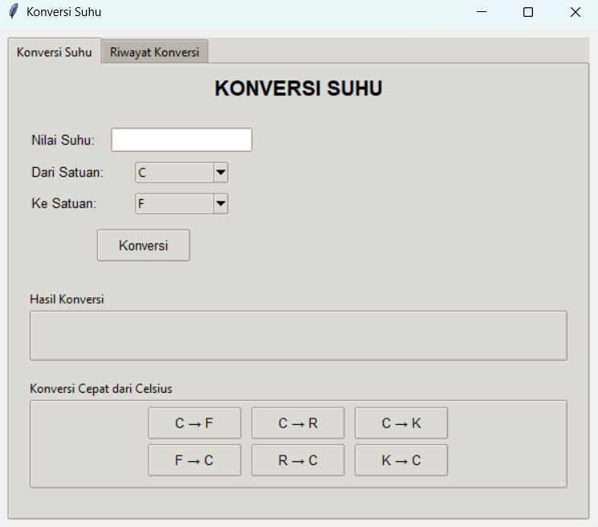

# Temperature conversion

## Deskripsi Proyek
Temperature conversion adalah aplikasi desktop untuk mengonversi nilai suhu antar empat satuan, yaitu Celsius, Fahrenheit, Reamur, dan Kelvin, dibangun menggunakan Tkinter dengan struktur kode modular (logika konversi, pengelolaan riwayat, dan antarmuka dipisah per file). Pengguna memasukkan nilai suhu, memilih satuan asal dan satuan tujuan, lalu aplikasi menampilkan hasilnya dan mencatatnya ke dalam riwayat. Proyek ini menyelesaikan masalah mengingat rumus konversi yang berbeda-beda untuk setiap pasangan satuan, dengan menyediakan satu aplikasi yang menangani seluruh 12 kombinasi konversi sekaligus.

## Tampilan Aplikasi

## Fitur Utama
- Konversi antar empat satuan suhu: Celsius (C), Fahrenheit (F), Reamur (R), dan Kelvin (K), mencakup seluruh 12 kombinasi pasangan satuan
- Pemilihan satuan asal dan satuan tujuan lewat dropdown
- Hasil ditampilkan dengan format yang jelas, misalnya `100°C = 212°F`
- Tombol Konversi Cepat dari Celsius ke Fahrenheit, Reamur, dan Kelvin, serta kebalikannya, untuk konversi umum tanpa memilih dropdown
- Konversi dari dan ke satuan yang sama langsung mengembalikan nilai aslinya tanpa perhitungan
- Validasi input dengan pesan error jika nilai yang dimasukkan bukan angka
- Antarmuka berbasis tab yang memisahkan Konversi Suhu dan Riwayat Konversi
- Riwayat konversi tersimpan otomatis ke file `history_konversi.json`, dengan tombol Refresh dan Hapus Riwayat (disertai dialog konfirmasi)

## Teknologi yang Digunakan
- Python 3.x
- Tkinter beserta modul `ttk`, `messagebox`, dan `scrolledtext`
- Modul `json`, `os`, dan `datetime`

## Arsitektur
Proyek ini disusun dengan pemisahan tanggung jawab antar file:
1. **`konversi_suhu.py`** berisi class `KonversiSuhu` dengan seluruh method berupa `@staticmethod`. Terdapat enam fungsi konversi dasar yang berpusat pada Celsius (misalnya `celsius_ke_fahrenheit()` dan `kelvin_ke_celsius()`), serta enam fungsi konversi gabungan (misalnya `fahrenheit_ke_kelvin()`) yang bekerja dengan menjadikan Celsius sebagai satuan perantara. Method `konversi_suhu()` memetakan setiap pasangan (satuan asal, satuan tujuan) ke fungsi yang sesuai lewat dictionary, dan melempar `ValueError` jika pasangan tidak didukung.
2. **`history_manager.py`** berisi class `HistoryManager` yang menangani riwayat ke `history_konversi.json`. Method `add_entry()` menambahkan satu entri beserta timestamp, `get_history()` mengambil data (dengan opsi batas jumlah), dan `clear_history()` mengosongkan riwayat.
3. **`gui.py`** berisi class `AplikasiKonversiSuhu` yang membangun dua tab. Method `konversi_suhu()` mengambil input, memanggil `KonversiSuhu`, menampilkan hasil, lalu mencatatnya ke riwayat, sedangkan `konversi_cepat()` menjalankan alur yang sama untuk tombol pintasan.
4. **`main.py`** menjadi entry point yang membuat jendela Tkinter dan menjalankan `AplikasiKonversiSuhu`.

## Pembelajaran Spesifik
- Menggunakan dictionary dengan tuple sebagai kunci (`('C', 'F')`) untuk memetakan pasangan satuan ke fungsi konversi, menggantikan percabangan if-elif yang akan sangat panjang untuk 12 kombinasi.
- Menyimpan fungsi sebagai nilai di dalam dictionary dan memanggilnya setelah ditemukan lewat `get()`, teknik yang membuat penambahan satuan baru cukup dengan menambah entri tanpa mengubah alur program.
- Menggunakan Celsius sebagai satuan perantara untuk konversi antar satuan non-Celsius (misalnya Fahrenheit ke Kelvin), sehingga rumus yang harus ditulis hanya enam dasar, bukan seluruh kombinasi dari nol.
- Menggunakan `@staticmethod` untuk class yang berisi fungsi murni tanpa state, sehingga dapat dipanggil langsung lewat nama class.
- Menyediakan jalur pintas (tombol konversi cepat) yang memakai logika konversi yang sama dengan jalur utama, menghindari duplikasi rumus di dalam kode antarmuka.