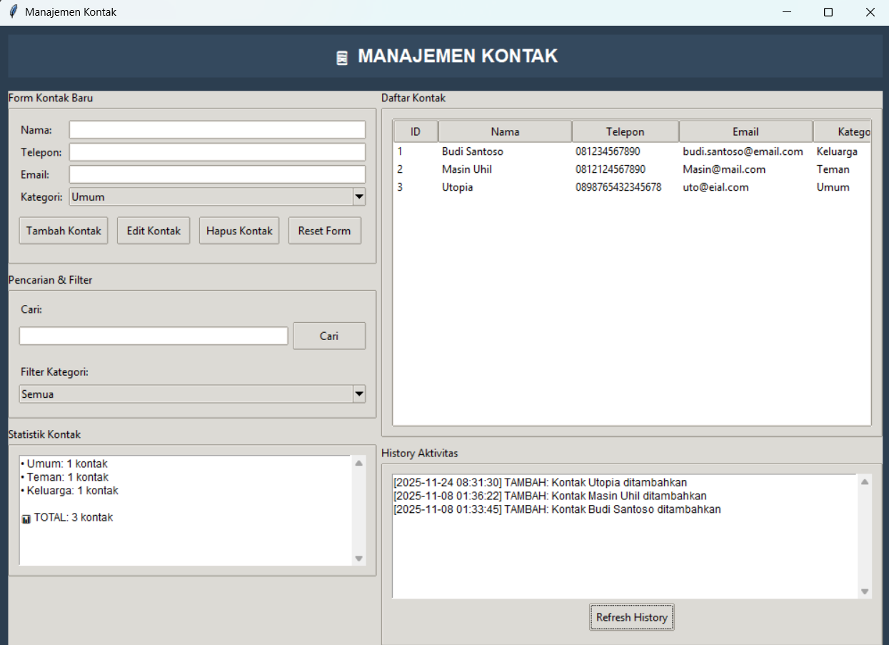

# Contact Management

## Deskripsi Proyek
Contact Management adalah aplikasi desktop untuk mengelola buku kontak, dibangun menggunakan Tkinter dan SQLite dengan struktur kode berlapis (antarmuka, model, dan akses database dipisah ke dalam paket tersendiri). Pengguna dapat menambah, mengedit, menghapus, mencari, dan memfilter kontak berdasarkan kategori, sekaligus melihat statistik jumlah kontak per kategori dan riwayat aktivitas. Proyek ini menyelesaikan masalah menyimpan dan mencari data kontak secara terstruktur, dengan setiap perubahan tercatat otomatis sehingga mudah dilacak.

## Tampilan Aplikasi

## Fitur Utama
- Tambah, edit, dan hapus kontak lengkap dengan nama, telepon, email, dan kategori
- Lima kategori bawaan: Keluarga, Teman, Kantor, Darurat, dan Umum
- Pencarian kontak berdasarkan kata kunci yang dicocokkan ke nama, nomor telepon, atau email
- Filter daftar kontak berdasarkan kategori lewat dropdown
- Daftar kontak ditampilkan dalam tabel (`Treeview`) yang diurutkan berdasarkan nama
- Klik ganda pada baris kontak untuk memuat datanya ke dalam form, memudahkan proses edit
- Panel statistik yang menampilkan jumlah kontak per kategori, diurutkan dari yang terbanyak
- Riwayat aktivitas yang mencatat setiap aksi tambah, edit, dan hapus beserta waktunya
- Dialog konfirmasi sebelum menghapus kontak, serta peringatan jika tidak ada kontak yang dipilih
- Seluruh data tersimpan di database SQLite lokal (`kontak.db`), sehingga tetap ada meskipun aplikasi ditutup

## Teknologi yang Digunakan
- Python 3.x
- Tkinter beserta modul `ttk`, `messagebox`, dan `scrolledtext`
- SQLite (modul `sqlite3`)
- Modul `re`, `json`, `os`, dan `datetime`

## Arsitektur
Proyek ini disusun sebagai paket berlapis dengan tanggung jawab yang jelas:
1. **`database/manager.py`** berisi class `DatabaseManager`, lapisan paling bawah yang berhubungan langsung dengan SQLite. Method `init_database()` membuat tiga tabel (`kontak`, `history`, dan `kategori`) beserta kategori bawaan, sedangkan `execute_query()`, `fetch_all()`, dan `log_history()` menjadi pintu akses umum untuk menjalankan query dan mencatat aktivitas.
2. **`models/kontak.py`** berisi class `Kontak` yang memuat seluruh logika data kontak di atas `DatabaseManager`: `tambah_kontak()`, `edit_kontak()`, `hapus_kontak()`, `cari_kontak()`, `ambil_semua_kontak()` (dengan opsi filter kategori), `statistik_kontak()` (query `GROUP BY` kategori), dan `ambil_history()`. Setiap perubahan data otomatis dicatat ke tabel riwayat.
3. **`gui/window.py`** berisi class `AplikasiKontak` yang membangun antarmuka dengan panel kiri (form kontak, pencarian dan filter, statistik) dan panel kanan (daftar kontak dan riwayat aktivitas). Method seperti `tambah_kontak()`, `edit_kontak()`, dan `hapus_kontak()` memvalidasi kondisi dasar, memanggil model, lalu menyegarkan tampilan lewat `refresh_kontak()` dan `refresh_statistik()`.
4. **`utils/helpers.py`** menyediakan fungsi bantu seperti `validasi_email()`, `validasi_telepon()`, dan `format_tanggal()`, serta kerangka fungsi `backup_database()` dan `generate_laporan()` yang masih berupa penanda untuk pengembangan berikutnya. Modul ini disiapkan sebagai pelengkap dan belum dipanggil dari alur utama aplikasi, yang saat ini hanya memeriksa bahwa kolom nama tidak kosong.
5. **`main.py`** menjadi entry point yang membuat jendela Tkinter dan menjalankan `AplikasiKontak`.

## Pembelajaran Spesifik
- Menyusun aplikasi menjadi paket berlapis (`database`, `models`, `gui`, `utils`), sehingga setiap lapisan hanya berurusan dengan tanggung jawabnya sendiri dan bergantung ke lapisan di bawahnya.
- Menggunakan query berparameter (`?`) pada seluruh operasi SQLite, praktik penting untuk mencegah SQL injection dibanding menyusun query dengan penggabungan string.
- Menggunakan `INSERT OR IGNORE` bersama kolom `UNIQUE` untuk mengisi data awal (kategori bawaan) secara aman, sehingga data tidak terduplikasi meskipun aplikasi dijalankan berkali-kali.
- Menggunakan `GROUP BY` dan `COUNT(*)` untuk menghasilkan statistik langsung dari database, tanpa perlu menghitungnya manual di sisi Python.
- Mencatat setiap perubahan data ke tabel riwayat (audit log) di dalam lapisan model, sehingga pencatatan selalu terjadi apa pun antarmuka yang memanggilnya.