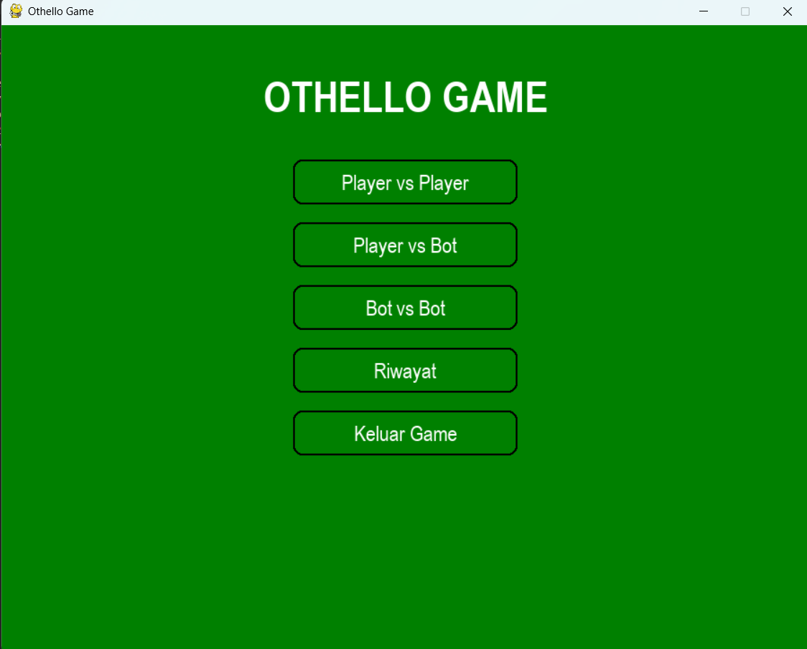

# Othello Game

## Deskripsi Proyek
Othello Game adalah permainan papan Othello (Reversi) berbasis GUI yang dibangun menggunakan Pygame dengan struktur kode modular (logika papan, kecerdasan buatan, logika permainan, dan tampilan dipisah ke dalam paket tersendiri). Permainan menyediakan tiga mode, yaitu Player vs Player, Player vs Bot, dan Bot vs Bot, dengan tiga tingkat kesulitan bot. Proyek ini menyelesaikan masalah mensimulasikan permainan strategi dua pemain secara lengkap, mulai dari aturan pembalikan bidak, lawan komputer dengan algoritma bertingkat, hingga pencatatan dan visualisasi riwayat permainan.

## Tampilan Aplikasi

## Fitur Utama
- Tiga mode permainan: Player vs Player, Player vs Bot (pemain selalu memegang bidak hitam), dan Bot vs Bot
- Tiga tingkat kesulitan bot: Mudah, Sedang, dan Tinggi
- Mode Bot vs Bot dapat dijalankan berulang sebanyak 1, 10, 50, atau 100 permainan berturut-turut
- Penerapan aturan Othello lengkap: validasi gerakan di delapan arah, pembalikan bidak lawan otomatis, giliran dilewati jika tidak ada gerakan valid, serta deteksi akhir permainan dan pemenang
- Skor kedua pemain dan giliran saat ini ditampilkan secara langsung selama permainan
- Layar hasil akhir yang menampilkan pemenang atau hasil seri beserta skor akhirnya
- Menu utama interaktif dengan tombol yang berubah warna saat disorot kursor
- Layar Riwayat yang menampilkan daftar permainan sebelumnya (mode, kesulitan, skor, pemenang, dan waktu)
- Tampilan grafik lingkaran (pie chart) hasil permainan Bot vs Bot, dibuat dengan Matplotlib lalu ditampilkan di dalam jendela Pygame
- Riwayat permainan tersimpan otomatis ke file `data/game_history.json`

## Teknologi yang Digunakan
- Python 3.x
- Pygame
- Matplotlib
- Modul `json`, `os`, `random`, `math`, `time`, `io`, dan `datetime`

## Arsitektur
Proyek ini disusun menjadi beberapa paket dengan tanggung jawab yang jelas:
1. **`utils/constants.py`** menyimpan seluruh konstanta terpusat: palet warna, ukuran papan dan sel, serta daftar delapan arah (`DIRECTIONS`) yang dipakai untuk memeriksa gerakan.
2. **`game/board.py`** berisi class `Board` yang menjadi inti aturan permainan. Method `is_valid_move()` memeriksa gerakan dengan menelusuri delapan arah, `make_move()` meletakkan bidak sekaligus membalikkan bidak lawan, `get_valid_moves()` mengumpulkan seluruh gerakan sah, serta `get_score()`, `is_game_over()`, dan `get_winner()` menangani skor dan hasil akhir.
3. **`game/ai.py`** berisi class `OthelloAI` dengan tiga tingkat kesulitan. Mode Mudah memberi nilai berdasarkan posisi (mengutamakan sudut dan tepi, menghindari kotak di samping sudut), Sedang menambahkan pertimbangan jumlah bidak yang dibalik dan mobilitas lawan, sedangkan Tinggi memakai algoritma minimax berkedalaman terbatas dengan evaluasi papan yang mempertimbangkan sudut, bidak stabil, dan mobilitas pada fase permainan yang berbeda. Setiap tingkat juga memiliki faktor keacakan agar permainan bervariasi.
4. **`game/game_logic.py`** berisi class `GameLogic` yang menghubungkan papan dan AI: mengatur mode permainan, memproses gerakan pemain (`make_move()`) maupun bot (`ai_move()`), melanjutkan ke permainan berikutnya pada mode Bot vs Bot (`next_game()`), dan menyimpan hasil permainan (`save_game_result()`).
5. **`utils/helpers.py`** berisi `save_game_history()` dan `load_game_history()` untuk membaca dan menulis riwayat ke file JSON.
6. **`gui/main_menu.py`**, **`gui/game_window.py`**, dan **`gui/history_window.py`** menangani seluruh tampilan Pygame: menu bertingkat (mode, kesulitan, jumlah permainan) dengan class `Button` buatan sendiri, layar papan permainan, serta layar riwayat beserta grafiknya.
7. **`main.py`** menjadi entry point yang menginisialisasi Pygame, membuat jendela, dan menjalankan menu utama.

## Pembelajaran Spesifik
- Mengimplementasikan aturan Othello dengan menelusuri delapan arah dari satu posisi, memanfaatkan daftar `DIRECTIONS` agar pemeriksaan dan pembalikan bidak tidak perlu ditulis berulang untuk setiap arah.
- Menerapkan algoritma minimax untuk lawan komputer, termasuk bagaimana menangani giliran yang dilewati ketika salah satu pihak tidak punya gerakan valid.
- Merancang beberapa tingkat kesulitan AI dengan pendekatan berbeda: heuristik posisi sederhana, penambahan pertimbangan mobilitas, hingga pencarian minimax, ditambah faktor keacakan agar bot tidak selalu memilih langkah yang sama.
- Menyalin objek papan (`_copy_board()`) sebelum mensimulasikan gerakan, sehingga evaluasi langkah oleh AI tidak mengubah papan permainan yang sebenarnya.
- Menampilkan grafik Matplotlib di dalam jendela Pygame dengan merender figure ke `BytesIO` lalu mengubahnya menjadi surface Pygame, teknik menggabungkan dua library visualisasi yang berbeda.
- Membuat komponen tombol sendiri (`Button`) di Pygame lengkap dengan efek hover dan deteksi klik, karena Pygame tidak menyediakan widget antarmuka siap pakai.