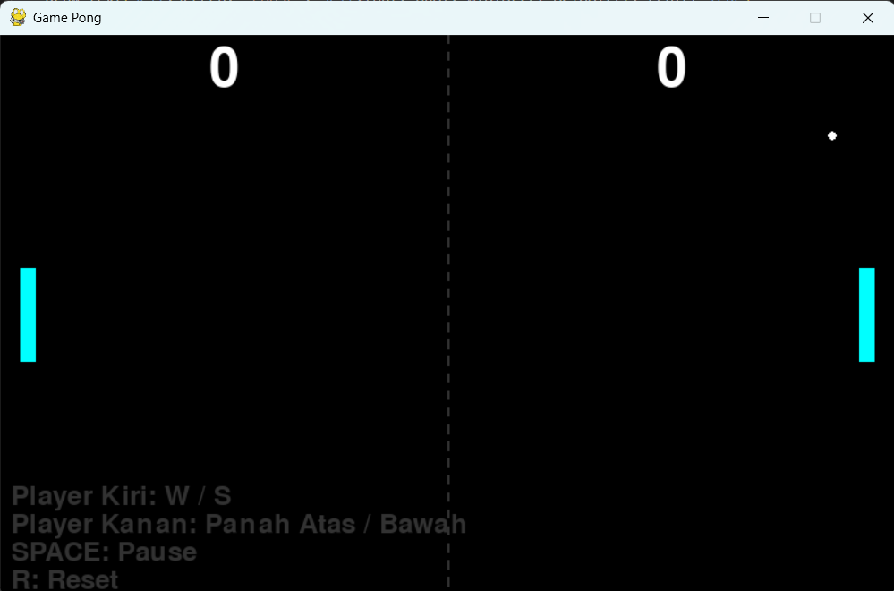

# Pong Game

## Deskripsi Proyek
Pong Game adalah replika permainan arcade klasik Pong untuk dua pemain, dibangun menggunakan Pygame dengan struktur kode modular (konfigurasi, entitas permainan, dan fungsi gambar dipisah ke dalam file tersendiri). Dua pemain masing-masing mengendalikan satu paddle di sisi kiri dan kanan layar untuk memantulkan bola, dan pemain pertama yang mencapai skor kemenangan memenangkan permainan. Proyek ini menyelesaikan masalah mensimulasikan game arcade dua pemain secara real-time, lengkap dengan deteksi tabrakan, sistem skor, fitur pause, dan reset permainan.

## Tampilan Aplikasi

## Fitur Utama
- Mode dua pemain dalam satu layar: pemain kiri memakai tombol W dan S, pemain kanan memakai panah atas dan bawah
- Paddle dibatasi agar tidak keluar dari batas atas dan bawah layar
- Bola memantul dari dinding atas dan bawah serta dari kedua paddle
- Arah awal bola ditentukan secara acak setiap kali permainan dimulai atau setelah terjadi gol
- Skor masing-masing pemain ditampilkan besar di bagian atas layar, dan bola kembali ke tengah setelah gol
- Permainan berakhir ketika salah satu pemain mencapai skor 5, disertai pengumuman pemenang
- Fitur pause dengan tombol SPACE, dan reset permainan dengan tombol R kapan saja
- Garis tengah putus-putus dan paddle dengan efek garis tepi (glow) sederhana
- Petunjuk kontrol ditampilkan langsung di layar
- Seluruh pengaturan permainan (ukuran layar, FPS, warna, ukuran dan kecepatan paddle serta bola, skor kemenangan) dipusatkan di `config.py`

## Teknologi yang Digunakan
- Python 3.x
- Pygame
- Modul `random` dan `sys`

## Arsitektur
Proyek ini disusun menjadi beberapa modul dengan tanggung jawab yang jelas:
1. **`config.py`** menyimpan seluruh nilai konfigurasi terpusat, sehingga gameplay dapat disesuaikan tanpa menelusuri banyak file.
2. **`game/paddle.py`** berisi class `Paddle` yang menangani pergerakan (`move_up()`, `move_down()`), pembatasan posisi di dalam layar (`update()`), dan penggambaran paddle beserta garis tepinya.
3. **`game/ball.py`** berisi class `Ball` yang menangani pergerakan, pemantulan (`bounce_x()` dan `bounce_y()`), deteksi tabrakan dengan paddle dan dinding, pemeriksaan gol lewat `check_score()`, serta `reset()` untuk mengembalikan bola ke tengah dengan arah acak.
4. **`game/score.py`** berisi class `Score` yang menyimpan dan menambah skor pemain kiri dan kanan.
5. **`utils/draw.py`** berisi fungsi gambar yang dapat dipakai ulang, yaitu `draw_text()` untuk menampilkan teks (dengan opsi rata tengah) dan `draw_dashed_line()` untuk menggambar garis putus-putus.
6. **`main.py`** berisi class `PongGame` yang menjadi orkestrator utama: `reset_game()` menyiapkan seluruh objek, `handle_input()` membaca tombol keyboard, `update()` memperbarui posisi dan seluruh deteksi tabrakan serta skor, `draw()` menggambar semua elemen, dan `run()` menjalankan game loop dengan frame rate tetap.

## Pembelajaran Spesifik
- Membangun game loop Pygame yang memisahkan tiga tahap di setiap frame, yaitu membaca input, memperbarui logika, dan menggambar, dengan `Clock.tick()` untuk menjaga frame rate tetap konsisten.
- Menggunakan `pygame.Rect` untuk merepresentasikan posisi sekaligus area tabrakan setiap objek, dan memanfaatkan `colliderect()` untuk mendeteksi tabrakan bola dengan paddle.
- Memisahkan konfigurasi ke dalam `config.py` agar nilai seperti kecepatan, ukuran, dan skor kemenangan dapat diubah di satu tempat saja.
- Memecah entitas permainan (paddle, bola, skor) menjadi class terpisah dengan satu tanggung jawab masing-masing, sehingga class `PongGame` cukup berperan sebagai pengatur alur.
- Menerapkan deteksi gol berdasarkan posisi bola terhadap batas kiri dan kanan layar, lalu menentukan pemain mana yang mendapat poin dari sisi mana bola keluar.