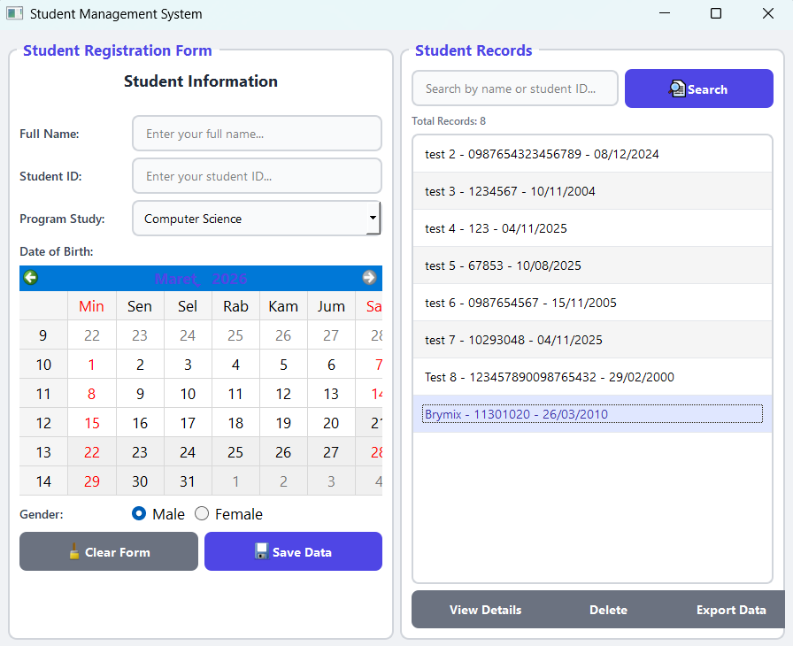

# Student Management System

## Deskripsi Proyek
Student Management System adalah aplikasi desktop untuk mencatat dan mengelola data mahasiswa, dibangun menggunakan PyQt5 dengan tampilan modern berbasis stylesheet kustom. Pengguna mengisi formulir pendaftaran (nama, NIM, program studi, tanggal lahir, dan jenis kelamin), lalu data tersimpan dan tampil pada daftar riwayat yang dapat dicari, dilihat detailnya, dihapus, atau diekspor. Proyek ini menyelesaikan masalah pencatatan data mahasiswa yang tersebar atau manual, dengan menyediakan satu aplikasi terpusat yang menyimpan data secara lokal dalam file JSON.

## Tampilan Aplikasi

## Fitur Utama
- Formulir pendaftaran dengan kolom nama lengkap, NIM, pilihan program studi, pemilihan tanggal lahir lewat kalender, dan pilihan jenis kelamin
- Validasi dasar: nama dan NIM wajib diisi sebelum data dapat disimpan
- Pesan konfirmasi berisi ringkasan data setelah mahasiswa berhasil didaftarkan
- Daftar riwayat mahasiswa yang menampilkan nama, NIM, dan tanggal lahir, lengkap dengan penghitung total data
- Pencarian mahasiswa berdasarkan nama atau NIM
- Jendela detail mahasiswa yang menampilkan nama, NIM, tanggal lahir, dan waktu pendaftaran
- Penghapusan data dengan dialog konfirmasi terlebih dahulu
- Export seluruh data ke file JSON dengan nama berformat timestamp, dipilih lewat dialog simpan file
- Data tersimpan otomatis ke file `students_data.json`, sehingga tetap ada meskipun aplikasi ditutup
- Tampilan modern dengan palet warna kustom, termasuk gaya khusus untuk widget kalender, diatur lewat stylesheet QSS

## Teknologi yang Digunakan
- Python 3.x
- PyQt5
- Modul `json`, `os`, `sys`, dan `datetime`

## Arsitektur
Proyek ini terdiri dari beberapa file dengan peran berbeda:
1. **`main.py`** berisi dua class utama. Class `StudentManager` menangani data mahasiswa di memori dan file `students_data.json`, dengan method `load_data()`, `save_data()`, `add_student()`, dan `get_all_students()`. Class `ModernStudentForm` membangun seluruh antarmuka: `create_form_container()` untuk formulir pendaftaran, `create_history_container()` untuk daftar riwayat beserta kolom pencarian dan tombol aksi, serta method penanganan aksi seperti `save_student()`, `search_students()`, `view_student_details()`, `delete_student()`, dan `export_data()`. Stylesheet lengkap diterapkan lewat `set_modern_style()`.
2. **`database.py`** berisi class `DatabaseManager` sebagai lapisan akses data berbasis JSON yang lebih lengkap (membuat file otomatis, menambah, menghapus, dan mencari data). Modul ini disiapkan sebagai pengembangan lanjutan dan belum dipanggil dari alur utama, yang saat ini memakai `StudentManager` di dalam `main.py`.
3. **`config.py`** menyimpan konfigurasi terpusat berupa pengaturan aplikasi (`APP_CONFIG`), warna tema (`STYLE_CONFIG`), dan aturan validasi panjang nama serta NIM (`VALIDATION_RULES`). Seperti `database.py`, file ini disiapkan sebagai fondasi dan belum dirujuk oleh `main.py`.

## Pembelajaran Spesifik
- Menyimpan objek data utuh pada item daftar lewat `QListWidgetItem.setData(Qt.UserRole, ...)`, sehingga saat item dipilih seluruh datanya dapat diambil kembali tanpa mencari ulang ke sumber data.
- Menggunakan `QCalendarWidget` untuk pemilihan tanggal lahir, yang mengurangi kesalahan format dibanding mengetik tanggal secara manual, lalu mengubah hasilnya menjadi teks berformat `dd/mm/yyyy`.
- Menggunakan `QButtonGroup` bersama `QRadioButton` agar pilihan jenis kelamin bersifat eksklusif.
- Menampilkan detail data dalam dialog modal (`QDialog` dengan `exec_()`) yang berisi tabel HTML sederhana, cara cepat menyajikan data berformat rapi tanpa membuat widget tabel tersendiri.
- Menerapkan stylesheet QSS yang kaya, termasuk penyesuaian komponen kompleks seperti kalender, untuk mendapatkan tampilan modern tanpa library tambahan.
- Memisahkan konfigurasi (`config.py`) dan akses data (`database.py`) dari antarmuka sebagai fondasi pengembangan, meski saat ini alur utama masih berpusat pada `main.py`.