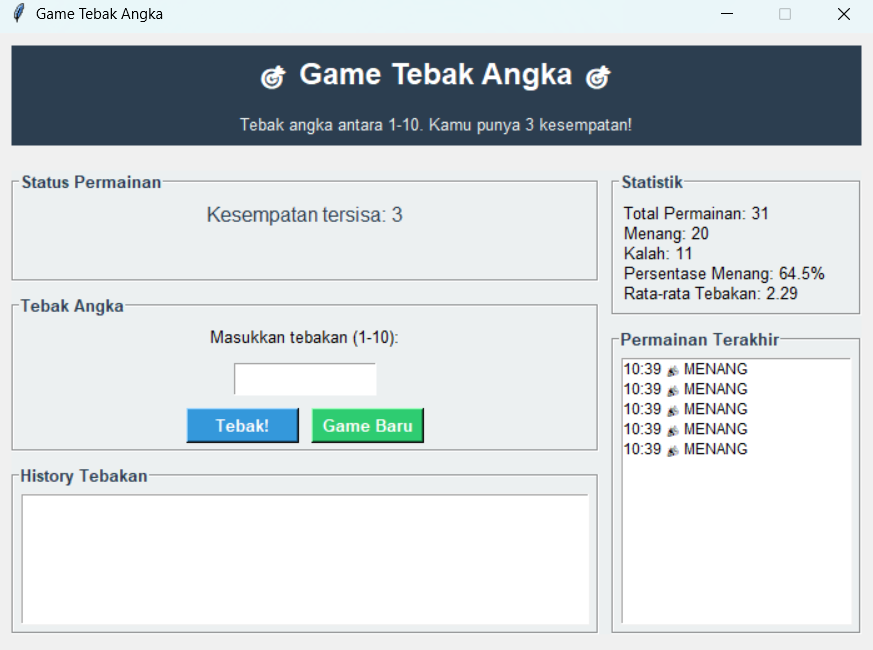

# Number Guessing Game

## Deskripsi Proyek
Number Guessing Game adalah permainan tebak angka berbasis GUI yang dibangun menggunakan Tkinter dengan struktur kode modular (logika permainan, pengelolaan riwayat, dan antarmuka dipisah per file). Pemain menebak sebuah angka rahasia antara 1 sampai 10 dengan tiga kesempatan, dan setiap tebakan yang salah diberi petunjuk apakah angka rahasia lebih besar atau lebih kecil. Proyek ini menyelesaikan masalah mensimulasikan permainan tebak angka klasik secara visual, lengkap dengan pencatatan riwayat dan statistik kemenangan dari seluruh permainan yang pernah dimainkan.

## Tampilan Aplikasi

## Fitur Utama
- Angka rahasia dihasilkan secara acak antara 1 sampai 10 setiap permainan baru
- Tiga kesempatan menebak, dengan sisa kesempatan yang ditampilkan di layar
- Petunjuk otomatis "lebih kecil" atau "lebih besar" setelah setiap tebakan yang salah
- Warna pesan status yang berubah sesuai hasil (menang, kalah, atau salah tebak)
- Validasi input: tebakan harus berupa angka, dan harus berada di rentang 1 sampai 10
- Tombol Enter sebagai pintasan untuk mengirim tebakan
- Tombol Game Baru untuk memulai ulang permainan kapan saja
- Daftar tebakan sebelumnya ditampilkan selama permainan berlangsung
- Panel statistik yang menampilkan total permainan, jumlah menang dan kalah, serta rata-rata jumlah tebakan
- Panel Permainan Terakhir yang menampilkan hasil beberapa permainan terbaru
- Riwayat tersimpan otomatis ke file `history_tebak_angka.json`, sehingga statistik tetap ada meskipun aplikasi ditutup

## Teknologi yang Digunakan
- Python 3.x
- Tkinter beserta modul `ttk` dan `messagebox`
- Modul `json`, `os`, `random`, dan `datetime`

## Arsitektur
Proyek ini disusun dengan pemisahan tanggung jawab antar file:
1. **`game_logic.py`** berisi class `GameLogic` yang menjadi inti aturan permainan tanpa bergantung pada antarmuka. Method `reset_game()` menyiapkan angka rahasia, jumlah kesempatan, daftar tebakan, dan status permainan, `tebak_angka()` memproses satu tebakan dan mengembalikan dictionary berisi status serta pesan, dan `get_game_state()` mengembalikan salinan kondisi permainan saat ini.
2. **`history_manager.py`** berisi class `HistoryManager` yang menyimpan riwayat ke `history_tebak_angka.json`. Method `add_game_record()` mencatat satu permainan (status, daftar tebakan, kesempatan terpakai, dan total tebakan), `get_recent_games()` mengambil permainan terbaru, dan `get_statistics()` menghitung total permainan, kemenangan, kekalahan, serta rata-rata jumlah tebakan.
3. **`gui.py`** berisi class `TebakAngkaApp` yang membangun antarmuka dan menghubungkan input pemain dengan `GameLogic` dan `HistoryManager`. Method `proses_tebakan()` mengambil input, memanggil logika permainan, menampilkan pesan sesuai status, dan mencatat hasil ke riwayat saat permainan berakhir, sedangkan `update_display()` menyegarkan sisa kesempatan, daftar tebakan, dan statistik.
4. **`main.py`** menjadi entry point yang membuat jendela Tkinter dan menjalankan `TebakAngkaApp`.

## Pembelajaran Spesifik
- Memisahkan logika permainan murni (`GameLogic`) dari antarmuka, sehingga aturan permainan dapat diuji atau dipakai ulang tanpa bergantung pada Tkinter.
- Mengembalikan hasil proses sebagai dictionary berisi `status` dan `pesan`, pola yang memudahkan antarmuka menentukan tampilan (warna, teks, dialog) hanya dengan membaca status tanpa mengetahui detail aturan.
- Menggunakan status permainan (`bermain`, `menang`, `kalah`) sebagai satu sumber kebenaran, sehingga tebakan setelah permainan selesai dapat ditolak dengan rapi.
- Mengembalikan salinan data (`copy()`) dari `get_game_state()`, agar kode antarmuka tidak dapat mengubah state internal permainan secara tidak sengaja.
- Menghitung statistik langsung dari riwayat tersimpan, sehingga angka total, kemenangan, dan rata-rata tebakan selalu konsisten dengan data yang ada.