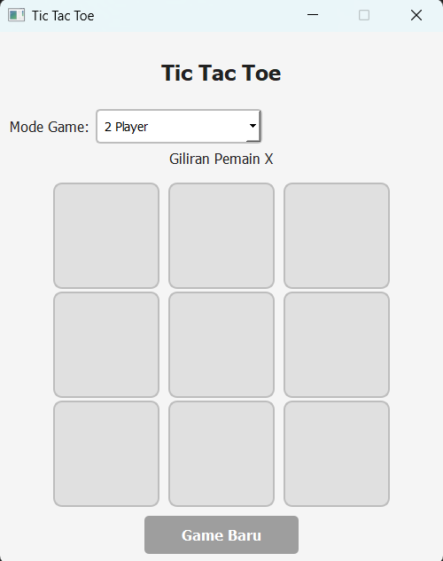

# Tic Tac Toe Game

## Deskripsi Proyek
Tic Tac Toe Game adalah permainan XO klasik berbasis GUI yang dibangun menggunakan PyQt5 dengan struktur kode modular (logika papan, kecerdasan buatan, logika permainan, dan tampilan dipisah ke dalam paket tersendiri). Pemain dapat bermain berdua pada satu komputer atau melawan komputer dengan tiga tingkat kesulitan. Proyek ini menyelesaikan masalah mensimulasikan permainan strategi sederhana secara interaktif, sekaligus menjadi contoh penerapan algoritma minimax pada lawan komputer yang tidak dapat dikalahkan pada tingkat tersulit.

## Tampilan Aplikasi

## Fitur Utama
- Empat mode permainan: 2 Player, vs AI (Easy), vs AI (Medium), dan vs AI (Hard), dipilih lewat dropdown
- Papan 3x3 berupa kotak tombol yang dapat diklik, dengan status giliran pemain yang selalu ditampilkan
- Deteksi kemenangan pada baris, kolom, dan kedua diagonal, serta deteksi permainan seri saat papan penuh
- Tiga tingkat kesulitan lawan komputer: Easy bergerak acak, Medium memilih langkah terbaik dengan peluang 70 persen dan acak 30 persen, sedangkan Hard selalu memilih langkah terbaik
- Langkah komputer diberi jeda singkat agar terasa alami dan antarmuka tidak membeku
- Tombol Game Baru untuk memulai ulang permainan kapan saja, termasuk saat berganti mode
- Tampilan sederhana bertema abu-abu, dengan warna khusus untuk menandai kemenangan dan hasil seri
- Pemisahan kode yang rapi antara aturan permainan, AI, dan antarmuka

## Teknologi yang Digunakan
- Python 3.x
- PyQt5
- Modul `random` dan `sys`

## Arsitektur
Proyek ini disusun menjadi beberapa paket dengan tanggung jawab yang jelas:
1. **`utils/constants.py`** menyimpan seluruh konstanta terpusat: palet warna, ukuran jendela dan papan, nama setiap mode permainan, serta simbol `X`, `O`, dan `EMPTY`.
2. **`game/board.py`** berisi class `Board` yang mengelola grid permainan: `make_move()` dan `is_valid_move()` untuk meletakkan simbol, `get_empty_cells()` dan `is_full()` untuk memeriksa sisa kotak, serta `check_winner()` dan `is_game_over()` untuk menentukan pemenang.
3. **`game/ai_player.py`** berisi class `AIPlayer` dengan tiga tingkat kesulitan. Method `get_move()` memilih langkah sesuai tingkat kesulitan, `_get_best_move()` mencoba setiap kotak kosong dan memilih yang bernilai tertinggi, dan `_minimax()` menelusuri seluruh kemungkinan permainan secara rekursif dengan skor yang memperhitungkan kedalaman, sehingga kemenangan yang lebih cepat dinilai lebih baik.
4. **`game/game_logic.py`** berisi class `GameLogic` yang menghubungkan papan dan AI: `new_game()` menyiapkan permainan sesuai mode, `make_move()` memproses langkah dan memeriksa hasil, `ai_move()` meminta langkah dari AI, serta `is_game_over()` dan `get_current_player()` untuk menyediakan status ke antarmuka.
5. **`ui/styles.py`** menghasilkan stylesheet QSS dari palet warna di `constants.py`, sedangkan **`ui/main_window.py`** berisi `TicTacToeWindow` yang membangun jendela (judul, pemilih mode, label status, papan tombol, dan tombol Game Baru) serta menangani klik pada setiap kotak.
6. **`main.py`** menjadi entry point yang membuat aplikasi PyQt dan menampilkan jendela utama.

## Pembelajaran Spesifik
- Menerapkan algoritma minimax secara rekursif untuk permainan dengan ruang kemungkinan kecil seperti Tic Tac Toe, sehingga komputer pada tingkat Hard dapat menelusuri seluruh kemungkinan dan memilih langkah optimal.
- Memasukkan kedalaman rekursi ke dalam skor (`10 - depth` dan `-10 + depth`), agar komputer lebih memilih menang secepat mungkin dan menunda kekalahan selama mungkin.
- Membedakan tingkat kesulitan lewat campuran langkah cerdas dan langkah acak (Medium memakai peluang 70 persen dan 30 persen), cara sederhana untuk membuat lawan terasa lebih manusiawi tanpa menulis algoritma yang berbeda.
- Menggunakan `QTimer.singleShot()` untuk memberi jeda pada langkah komputer tanpa memblokir antarmuka, berbeda dengan `time.sleep()` yang akan membuat jendela tidak responsif.
- Membangun papan permainan dari grid tombol (`QGridLayout` dan `QPushButton`) dan memisahkan penyegaran tampilan (`update_board()`) dari logika permainan, sehingga state permainan menjadi satu-satunya sumber kebenaran.
- Menurunkan stylesheet dari kamus warna di `constants.py`, sehingga perubahan tema cukup dilakukan di satu tempat.